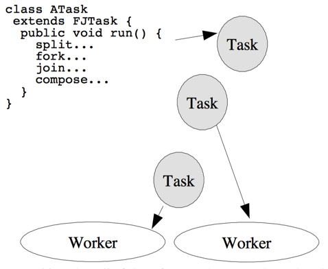
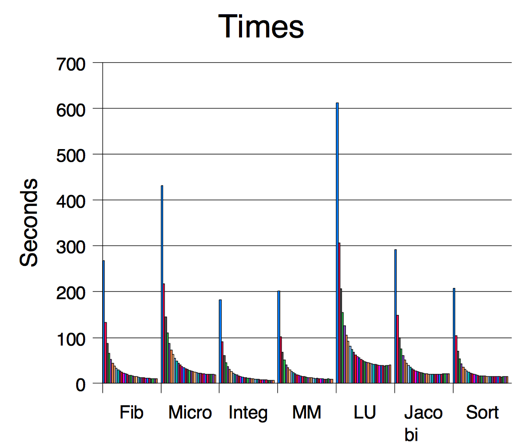
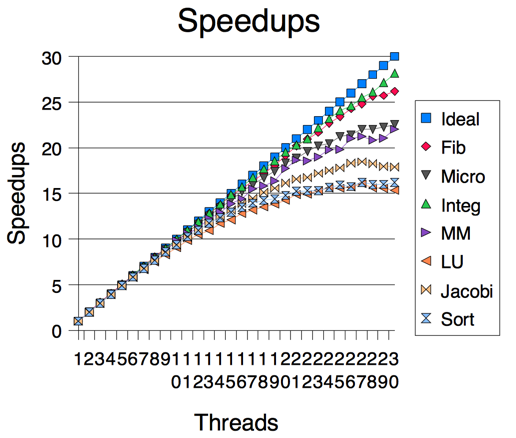
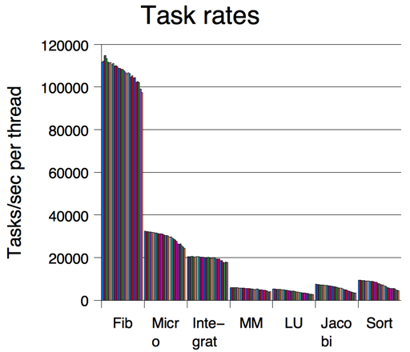
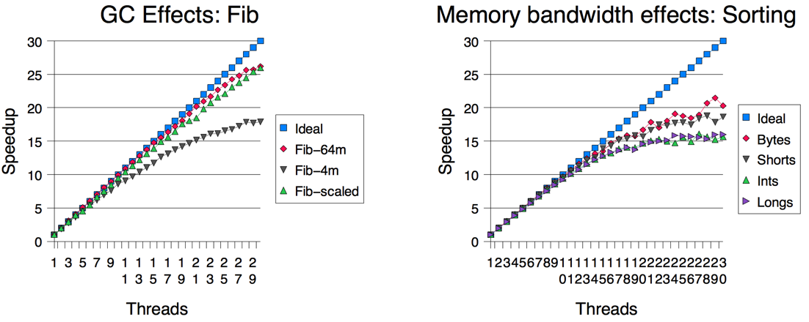
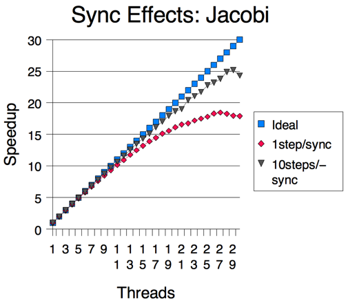
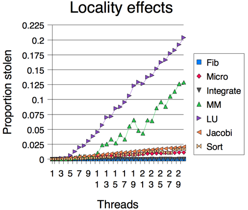
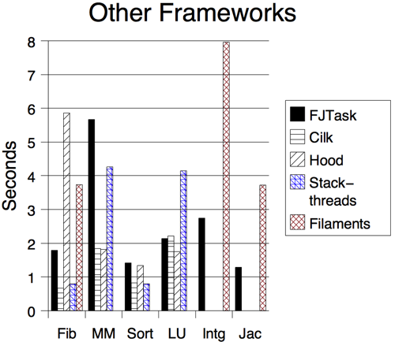

原文链接：[A Java Fork/Join Framework(PDF)](http://gee.cs.oswego.edu/dl/papers/fj.pdf) - _Doug Lea_  
基于[并发编程网 – ifeve.com](http://ifeve.com/)上 _Alex_/_萧欢_ 翻译、_方腾飞_ 校对的译文稿：[Java Fork Join 框架](http://ifeve.com/a-java-fork-join-framework/)  
译文发在[并发编程网 – ifeve.com](http://ifeve.com/)：[`Java` `Fork/Join`框架](http://ifeve.com/java-fork-join-framework/)， 2017-11-02

# `Java` `Fork/Join`框架

## :apple: 译序

_Doug Lea_ 大神关于`Java 7`引入的他写的`Fork/Join`框架的论文。

[响应式编程](https://www.reactivemanifesto.org/zh-CN)（`Reactive Programming` / `RP`）作为一种范式在整个业界正在逐步受到认可和落地，是对过往系统的业务需求理解梳理之后对系统技术设计/架构模式的提升总结。`Java`作为一个成熟平台，对于趋势一向有些稳健的接纳和跟进能力，有着令人惊叹的生命活力：

1. `Java 7`提供了`ForkJoinPool`，支持了`Java 8`提供的`Stream`。
1. 另外`Java 8`还提供了`Lamda`（有效地表达和使用`RP`需要`FP`的语言构件和理念）。
1. 有了前面的这些稳健但不失时机的准备，在`Java 9`中提供了面向`RP`的官方[`Flow API`](https://community.oracle.com/docs/DOC-1006738)，实际上是直接把[`Reactive Streams`](http://www.reactive-streams.org/)的接口加在`Java`标准库中，即[`Reactive Streams`规范](https://github.com/reactive-streams/reactive-streams-jvm#specification)转正了，`Reactive Streams`是`RP`的基础核心组件。`Flow API`标志着`RP`由集市式的自由探索阶段 向 教堂式的统一使用的转变。

通过上面这些说明，可以看到`ForkJoinPool`的基础重要性。

对了，另外提一下`Java 9`的`Flow API`的`@author`也是 _Doug Lee_ 哦～

PS:  
[自己](http://weibo.com/oldratlee)理解粗浅，翻译中肯定会有不少不足和不对之处，欢迎建议（[提交Issue](https://github.com/oldratlee/translations/issues)）和指正（[Fork后提交代码](https://github.com/oldratlee/translations/fork)）！ :two_hearts:

-------------------------------------------------------------------------------


<!-- START doctoc generated TOC please keep comment here to allow auto update -->
<!-- DON'T EDIT THIS SECTION, INSTEAD RE-RUN doctoc TO UPDATE -->


- [0. 摘要](#0-%E6%91%98%E8%A6%81)
- [1. 简介](#1-%E7%AE%80%E4%BB%8B)
- [2. 设计](#2-%E8%AE%BE%E8%AE%A1)
    - [2.1 `work−stealing`](#21-work%E2%88%92stealing)
- [3. 实现](#3-%E5%AE%9E%E7%8E%B0)
    - [3.1 双端队列](#31-%E5%8F%8C%E7%AB%AF%E9%98%9F%E5%88%97)
    - [3.2 抢断和闲置](#32-%E6%8A%A2%E6%96%AD%E5%92%8C%E9%97%B2%E7%BD%AE)
- [4. 性能](#4-%E6%80%A7%E8%83%BD)
    - [4.1 加速效果](#41-%E5%8A%A0%E9%80%9F%E6%95%88%E6%9E%9C)
    - [4.2 垃圾回收](#42-%E5%9E%83%E5%9C%BE%E5%9B%9E%E6%94%B6)
    - [4.3 内存分配和字宽](#43-%E5%86%85%E5%AD%98%E5%88%86%E9%85%8D%E5%92%8C%E5%AD%97%E5%AE%BD)
    - [4.4 任务同步](#44-%E4%BB%BB%E5%8A%A1%E5%90%8C%E6%AD%A5)
    - [4.5 任务局部性](#45-%E4%BB%BB%E5%8A%A1%E5%B1%80%E9%83%A8%E6%80%A7)
    - [4.6 与其他框架比较](#46-%E4%B8%8E%E5%85%B6%E4%BB%96%E6%A1%86%E6%9E%B6%E6%AF%94%E8%BE%83)
- [5. 结论](#5-%E7%BB%93%E8%AE%BA)
- [6. 致谢](#6-%E8%87%B4%E8%B0%A2)
- [7. 参考文献](#7-%E5%8F%82%E8%80%83%E6%96%87%E7%8C%AE)

<!-- END doctoc generated TOC please keep comment here to allow auto update -->

-------------------------------------------------------------------------------

# 0. 摘要

这篇论文描述了`Fork/Join`框架的设计、实现以及性能，这个框架通过（递归的）把问题划分为子任务，然后并行的执行这些子任务，等所有的子任务都结束的时候，再合并最终结果的这种方式来支持并行计算编程。总体的设计参考了为`Cilk`设计的`work-stealing`框架。就设计层面来说主要是围绕如何高效的去构建和管理任务队列以及工作线程来展开的。性能测试的数据显示良好的并行计算程序将会提升大部分应用，同时也暗示了一些潜在的可以提升的空间。

> 校注1： `Cilk`是英特尔`Cilk`语言。英特尔`C++`编辑器的新功能`Cilk`语言扩展技术，为`C/C++`语言增加了细粒度任务支持，使其为新的和现有的软件增加并行性来充分发掘多处理器能力变得更加容易。

# 1. 简介

`Fork/Join`并行方式是获取良好的并行计算性能的一种最简单同时也是最有效的设计技术。`Fork/Join`并行算法是我们所熟悉的分治算法的并行版本，典型的用法如下：

```java
Result solve(Problem problem) {
    if (problem is small) {
        directly solve problem
    } else {
        split problem into independent parts
        fork new subtasks to solve each part
        join all subtasks
        compose result from subresults
    }
}
```

`fork`操作将会启动一个新的并行`Fork/Join`子任务。`join`操作会一直等待直到所有的子任务都结束。`Fork/Join`算法，如同其他分治算法一样，总是会递归的、反复的划分子任务，直到这些子任务可以用足够简单的、短小的顺序方法来执行。

一些相关的编程技术和实例在[《`Java`并发编程 —— 设计原则与模式 第二版》](https://book.douban.com/subject/1244021/)<sup>[7]</sup> 4.4章节中已经讨论过。这篇论文将讨论`FJTask`的设计（第2节）、实现（第3节）以及性能（第4节），它是一个支持并行编程方式的`Java™`框架。`FJTask` 作为`util.concurrent`软件包的一部分，目前可以在 http://gee.cs.oswego.edu/ 获取到。

# 2. 设计

`Fork/Join`程序可以在任何支持以下特性的框架之上运行：框架能够让构建的子任务并行执行，并且拥有一种等待子任务运行结束的机制。然而，`java.lang.Thread`类（同时也包括`POSIX pthread`，这些也是`Java`线程所基于的基础）对`Fork/Join`程序来说并不是最优的选择：

- `Fork/Join`任务对同步和管理有简单的和常规的需求。相对于常规的线程来说，`Fork/Join`任务所展示的计算布局将会带来更加灵活的调度策略。例如，`Fork/Join`任务除了等待子任务外，其他情况下是不需要阻塞的。因此传统的用于跟踪记录阻塞线程的代价在这种情况下实际上是一种浪费。
- 对于一个合理的基础任务粒度来说，构建和管理一个线程的代价甚至可以比任务执行本身所花费的代价更大。尽管粒度是应该随着应用程序在不同特定平台上运行而做出相应调整的。但是超过线程开销的极端粗粒度会限制并行的发挥。

简而言之，`Java`标准的线程框架对`Fork/Join`程序而言太笨重了。但是既然线程构成了很多其他的并发和并行编程的基础，完全消除这种代价或者为了这种方式而调整线程调度是不可能（或者说不切实际的）。

尽管这种思想已经存在了很长时间了，但是第一个发布的能系统解决这些问题的框架是`Cilk`<sup>[5]</sup>。`Cilk`和其他轻量级的框架是基于操作系统的基本的线程和进程机制来支持特殊用途的`Fork/Join`程序。这种策略同样适用于`Java`，尽管`Java`线程是基于低级别的操作系统的能力来实现的。创造这样一个轻量级的执行框架的主要优势是能够让`Fork/Join`程序以一种更直观的方式编写，进而能够在各种支持`JVM`的系统上运行。



`FJTask`框架是基于`Cilk`设计的一种演变。其他的类似框架有`Hood`<sup>[4]</sup>、`Filaments`<sup>[8]</sup>、`Stackthreads`<sup>[10]</sup>以及一些依赖于轻量级执行任务的相关系统。所有这些框架都采用和操作系统把线程映射到`CPU`上相同的方式来把任务映射到线程上。只是他们会使用`Fork/Join`程序的简单性、常规性以及一致性来执行这种映射。尽管这些框架都能适应不能形式的并行程序，他们优化了`Fork/Join`的设计：

- 一组工作者线程池是准备好的。每个工作线程都是标准的（『重量级』）处理存放在队列中任务的线程（这地方指的是`Thread`类的子类`FJTaskRunner`的实例对象）。通常情况下，工作线程应该与系统的处理器数量一致。对于一些原生的框架例如说`Cilk`，他们首先将映射成内核线程或者是轻量级的进程，然后再在处理器上面运行。在`Java`中，虚拟机和操作系统需要相互结合来完成线程到处理器的映射。然后对于计算密集型的运算来说，这种映射对于操作系统来说是一种相对简单的任务。任何合理的映射策略都会导致线程映射到不同的处理器。
- 所有的`Fork/Join`任务都是轻量级执行类的实例，而不是线程实例。在`Java`中，独立的可执行任务必须要实现`Runnable`接口并重写`run`方法。在`FJTask`框架中，这些任务将作为子类继承`FJTask`而不是`Thread`，它们都实现了`Runnable`接口。（对于上面两种情况来说，一个类也可以选择实现`Runnable`接口，类的实例对象既可以在任务中执行也可以在线程中执行。因为任务执行受到来自`FJTask`方法严厉规则的制约，子类化`FJTask`相对来说更加方便，也能够直接调用它们。）
- 我们将采用一个特殊的队列和调度原则来管理任务并通过工作线程来执行任务。这些机制是由任务类中提供的相关方式实现的：主要是由`fork`、`join`、`isDone`（一个结束状态的标示符），和一些其他方便的方法，例如调用`coInvoke`来分解合并两个或两个以上的任务。
- 一个简单的控制和管理类（这里指的是`FJTaskRunnerGroup`）来启动工作线程池，并初始化执行一个由正常的线程调用所触发的`Fork/Join`任务（就类似于`Java`程序中的`main`方法）。

作为一个给程序员演示这个框架如何运行的标准实例，这是一个计算法斐波那契函数的类。

```java
class Fib extends FJTask {
    static final int threshold = 13;
    volatile int number; // arg/result

    Fib(int n) {
        number = n;
    }

    int getAnswer() {
        if (!isDone())
            throw new IllegalStateException();
        return number;
    }

    public void run() {
        int n = number;
        if (n <= threshold) // granularity ctl
            number = seqFib(n);
        else {
            Fib f1 = new Fib(n - 1);
            Fib f2 = new Fib(n - 2);
            coInvoke(f1, f2);
            number = f1.number + f2.number;
        }
    }

    public static void main(String[] args) {
        try {
            int groupSize = 2; // for example
            FJTaskRunnerGroup group = new FJTaskRunnerGroup(groupSize);
            Fib f = new Fib(35); // for example
            group.invoke(f);
            int result = f.getAnswer();
            System.out.println("Answer: " + result);
        } catch (InterruptedException ex) {
        }
    }

    int seqFib(int n) {
        if (n <= 1) return n;
        else return seqFib(n − 1) + seqFib(n − 2);
    }
}
```


这个版本在第4节中所提到的平台上的运行速度至少比每个任务都在`Thread`类中运行快30倍。在保持性能的同时这个程序仍然维持着`Java`多线程程序的可移植性。对程序员来说通常有两个参数值的他们关注：

- 对于工作线程的创建数量，通常情况下可以与平台所拥有的处理器数量保持一致（或者更少，用于处理其他相关的任务，或者有些情况下更多，来提升非计算密集型任务的性能）。
- 一个粒度参数代表了创建任务的代价会大于并行化所带来的潜在的性能提升的临界点。这个参数更多的是取决于算法而不是平台。通常在单处理器上运行良好的临界点，在多处理器平台上也会发挥很好的效果。作为一种附带的效益，这种方式能够与`Java`虚拟机的动态编译机制很好的结合，而这种机制在对小块方法的优化方面相对于单块的程序来说要好。这样，加上数据本地化的优势，`Fork/Join`算法的性能即使在单处理器上面的性能都较其他算法要好。

## 2.1 `work−stealing`

`Fork/Join`框架的核心在于轻量级调度机制。`FJTask`采用了`Cilk`的`work-stealing`所采用的基本调度策略：


- 每一个工作线程维护自己的调度队列中的可运行任务。
- 队列以双端队列的形式被维护（注：`deques`通常读作『decks』），不仅支持后进先出 —— `LIFO`的`push`和`pop`操作，还支持先进先出 —— `FIFO`的`take`操作。
- 对于一个给定的工作线程来说，任务所产生的子任务将会被放入到工作者自己的双端队列中。
- 工作线程使用后进先出 —— `LIFO`（最新的元素优先）的顺序，通过弹出任务来处理队列中的任务。
- 当一个工作线程的本地没有任务去运行的时候，它将使用先进先出 —— `FIFO`的规则尝试随机的从别的工作线程中拿（『窃取』）一个任务去运行。
- 当一个工作线程触及了`join`操作，如果可能的话它将处理其他任务，直到目标任务被告知已经结束（通过`isDone`方法）。所有的任务都会无阻塞的完成。
- 当一个工作线程无法再从其他线程中获取任务和失败处理的时候，它就会退出（通过`yield`、`sleep`和/或者优先级调整，参考第3节）并经过一段时间之后再度尝试直到所有的工作线程都被告知他们都处于空闲的状态。在这种情况下，他们都会阻塞直到其他的任务再度被上层调用。

使用后进先出 —— `LIFO`用来处理每个工作线程的自己任务，但是使用先进先出 —— `FIFO`规则用于获取别的任务，这是一种被广泛使用的进行递归`Fork/Join`设计的一种调优手段。引用<sup>[5]</sup>讨论了详细讨论了里面的细节。

让窃取任务的线程从队列拥有者相反的方向进行操作会减少线程竞争。同样体现了递归分治算法的大任务优先策略。因此，更早期被窃取的任务有可能会提供一个更大的单元任务，从而使得窃取线程能够在将来进行递归分解。

作为上述规则的一个后果，对于一些基础的操作而言，使用相对较小粒度的任务比那些仅仅使用粗粒度划分的任务以及那些没有使用递归分解的任务的运行速度要快。尽管相关的少数任务在大多数的`Fork/Join`框架中会被其他工作线程窃取，但是创建许多组织良好的任务意味着只要有一个工作线程处于可运行的状态，那么这个任务就有可能被执行。

# 3. 实现

这个框架是由大约800行纯`Java`代码组成，主要的类是`FJTaskRunner`，它是`java.lang.Thread`的子类。`FJTask`自己仅仅维持一个关于结束状态的布尔值，所有其他的操作都是通过当前的工作线程来代理完成的。`JFTaskRunnerGroup`类用于创建工作线程，维护一些共享的状态（例如：所有工作线程的标示符，在窃取操作时需要），同时还要协调启动和关闭。

更多实现的细节文档可以在`util.concurrent`并发包中查看。这一节只着重讨论两类问题以及在实现这个框架的时候所形成的一些解决方案：支持高效的双端列表操作（`push`、`pop`和`take`）， 并且当工作线程在尝试获取新的任务时维持窃取的协议。

## 3.1 双端队列

_（校注：双端队列中的元素可以从两端弹出，其限定插入和删除操作在队列的两端进行。）_

为了能够获得高效以及可扩展的执行任务，任务管理需要越快越好。创建、发布、和弹出（或者出现频率很少的获取）任务在顺序编程模式中会引发程序调用开销。更低的开销可以使得程序员能够构建更小粒度的任务，最终也能更好的利用并行所带来的益处。

`Java`虚拟机会负责任务的内存分配。`Java`垃圾回收器使我们不需要再去编写一个特殊的内存分配器去维护任务。相对于其他语言的类似框架，这个原因使我们大大降低了实现`FJTask`的复杂性以及所需要的代码数。

双端队列的基本结构采用了很常规的一个结构 —— 使用一个数组（尽管是可变长的）来表示每个队列，同时附带两个索引：`top`索引就类似于数组中的栈指针，通过`push`和`pop`操作来改变。`base`索引只能通过`take`操作来改变。鉴于`FJTaskRunner`操作都是无缝的绑定到双端队列的细节之中，（例如，`fork`直接调用`push`），所以这个数据结构直接放在类之中，而不是作为一个单独的组件。

但是双端队列的元素会被多线程并发的访问，在缺乏足够同步的情况下，而且单个的`Java`数组元素也不能声明为`volatile`变量（校注：[声明成`volatile`的数组](http://ifeve.com/volatile-array-visiblity/ "volatile是否能保证数组中元素的可见性？")，其元素并不具备`volatile`语意），每个数组元素实际上都是一个固定的引用，这个引用指向了一个维护着单个`volatile`引用的转发对象。一开始做出这个决定主要是考虑到`Java`内存模型的一致性。但是在这个级别它所需要的间接寻址被证明在一些测试过的平台上能够提升性能。可能是因为访问邻近的元素而降低了缓存争用，这样内存里面的间接寻址会更快一点。

实现双端队列的主要挑战来自于同步和他的撤销。尽管在`Java`虚拟机上使用经过优化过的同步工具，对于每个`push`和`pop`操作都需要获取锁还是让这一切成为性能瓶颈。然后根据以下的观察结果我们可以修改`Clik`中的策略，从而为我们提供一种可行的解决方案：

- `push`和`pop`操作仅可以被工作线程的拥有者所调用。
- 对`take`的操作很容易会由于窃取任务线程在某一时间对`take`操作加锁而限制。（双端队列在必要的时间也可以禁止`take`操作。）这样，控制冲突将被降低为两个部分同步的层次。
- `pop`和`take`操作只有在双端队列为空的时候才会发生冲突，否则的话，队列会保证他们在不同的数组元素上面操作。

把`top`和`base`索引定义为`volatile`变量可以保证当队列中元素不止一个时，`pop`和`take`操作可以在不加锁的情况下进行。这是通过一种类似于`Dekker`算法来实现的。当`push`预递减到`top`时：

```java
if (–top >= base) ...
```

和`take`预递减到`base`时：

```java
if (++base < top) ...
```

在上述每种情况下他们都通过比较两个索引来检查这样是否会导致双端队列变成一个空队列。一个不对称的规则将用于防止潜在的冲突：`pop`会重新检查状态并在获取锁之后继续（对`take`所持有的也一样），直到队列真的为空才退出。而`take`操作会立即退出，特别是当尝试去获得另外一个任务。与其他类似使用`Clik`的`THE`协议一样，这种不对称性是唯一重要的改变。

使用`volatile`变量索引`push`操作在队列没有满的情况下不需要同步就可以进行。如果队列将要溢出，那么它首先必须要获得队列锁来重新设置队列的长度。其他情况下，只要确保`top`操作排在队列数组槽盛在抑制干涉带之后更新。

在随后的初始化实现中，发现有好几种`JVM`并不符合`Java`内存模型中正确读取写入的`volatile`变量的规则。作为一个工作区，`pop`操作在持有锁的情况下重试的条件已经被调整为：如果有两个或者更少的元素，并且`take`操作加了第二把锁以确保内存屏障效果，那么重试就会被触发。只要最多只有一个索引被拥有者线程丢失这就是满足的，并且只会引起轻微的性能损耗。

## 3.2 抢断和闲置

在抢断式工作框架中，工作线程对于他们所运行的程序对同步的要求一无所知。他们只是构建、发布、弹出、获取、管理状态和执行任务。这种简单的方案使得当所有的线程都拥有很多任务需要去执行的时候，它的效率很高。然而这种方式是有代价的，当没有足够的工作的时候它将依赖于试探法。也就是说，在启动一个主任务，直到它结束，在有些`Fork/Join`算法中都使用了全面停止的同步指针。

主要的问题在于当一个工作线程既无本地任务也不能从别的线程中抢断任务时怎么办。如果程序运行在专业的多核处理器上面，那么可以依赖于硬件的忙等待自旋循环的去尝试抢断一个任务。然而，即使这样，尝试抢断还是会增加竞争，甚至会导致那些不是闲置的工作线程降低效率（由于锁协议，3.1节中）。除此之外，在一个更适合此框架运行的场景中，操作系统应该能够很自信的去运行那些不相关并可运行的进程和线程。

`Java`中并没有十分健壮的工作来保证这个，但是在实际中它往往是可以让人接受的。一个抢断失败的线程在尝试另外的抢断之前会降低自己的优先级，在尝试抢断之间执行`Thread.yeild`操作，然后将自己的状态在`FJTaskRunnerGroup`中设置为不活跃的。他们会一直阻塞直到有新的主线程。其他情况下，在进行一定的自旋次数之后，线程将进入休眠阶段，他们会休眠而不是放弃抢断。强化的休眠机制会给人造成一种需要花费很长时间去划分任务的假象。但是这似乎是最好的也是通用的折中方案。框架的未来版本也许会支持额外的控制方法，以便于让程序员在感觉性能受到影响时可以重写默认的实现。

# 4. 性能

如今，随着编译器与`Java`虚拟机性能的不断提升，性能测试结果也仅仅只能适用一时。但是，本节中所提到的测试结果数据却能揭示`Fork/Join`框架的基本特性。

下面表格中简单介绍了在下文将会用到的一组`Fork/Join`测试程序。这些程序是从`util.concurrent`包里的示例代码改编而来，用来展示`Fork/Join`框架在解决不同类型的问题模型时所表现的差异，同时得到该框架在一些常见的并行测试程序上的测试结果。

程序                     | 描述
--------------           | ------------------
`Fib`（菲波那契数列）    | 如第2节所描述的`Fibonnaci`程序，其中参数值为47阀值为13
`Integrate`（求积分）    | 使用递归高斯求积对公式  求-47到48的积分，**_`i`_** 为1到5之间的偶数
`Micro`（求微分）        | 对一种棋盘游戏寻找最好的移动策略，每次计算出后面四次移动
`Sort`（排序）           | 使用合并/快速排序算法对1亿数字进行排序（基于`Cilk`算法）
`MM`（矩阵相乘）         | 2048 X 2048的`double`类型的矩阵进行相乘
`LU`（矩阵分解）         | 4096 X 4096的`double`类型的矩阵进行分解
`Jacobi`（雅克比迭代法） | 对一个4096 X 4096的`double`矩阵使用迭代方法进行矩阵松弛，迭代次数上限为100

下文提到的主要的测试，其测试程序都是运行在`Sun Enterprise 10000`服务器上，该服务器拥有30个`CPU`，操作系统为`Solaris 7`系统，运行`Solaris`商业版`1.2` `JVM`（`2.2.2_05`发布版本的一个早期版本）。同时，`Java`虚拟机的关于线程映射的环境参数选择为『`bound threads`』（译者注：`XX:+UseBoundThreads`，绑定用户级别的线程到内核线程，只与`Solaris`有关），而关于虚拟机的内存参数设置在4.2章节讨论。另外，需要注意的是下文提到的部分测试则是运行在拥有4 `CPU`的`Sun Enterprise 450`服务器上。



为了降低定时器粒度以及`Java`虚拟机启动因素对测试结果的影响，测试程序都使用了数量巨大的输入参数。而其它一些启动因素我们通过在启动定时器之前先运行初始化任务来进行屏蔽。所得到的测试结果数据，大部分都是在三次测试结果的中间值，然而一些测试数据仅仅来自一次运行结果（包括4.2 \~ 4.4章节很多测试），因此这些测试结果会有噪音表现。

## 4.1 加速效果

通过使用不同数目（1 \~ 30）的工作线程对同一问题集进行测试，用来得到框架的扩展性测试结果。虽然我们无法保证`Java`虚拟机是否总是能够将每一个线程映射到不同的空闲`CPU`上，同时，我们也没有证据来证明这点。有可能映射一个新的线程到`CPU`的延迟会随着线程数目的增加而变大，也可能会随不同的系统以及不同的测试程序而变化。但是，所得到的测试结果的确显示出增加线程的数目确实能够增加使用的`CPU`的数目。



加速比通常表示为 **_<code>Time<sub>n</sub> / Time<sub>1<sub></code>_**。如上图所示，其中求积分的程序表现出最好的加速比（30个线程的加速比为28.2），表现最差的是矩阵分解程序（30线程是加速比只有15.35）

另一种衡量扩展性的依据是：任务执行率，及执行一个单独任务（这里的任务有可能是递归分解节点任务也可能是根节点任务）所开销的平均时间。下面的数据显示出一次性执行各个程序所得到的任务执行率数据。很明显，单位时间内执行的任务数目应该是固定常量。然而事实上，随着线程数目增加，所得到的数据会表现出轻微的降低，这也表现出其一定的扩展性限制。这里需要说明的是，之所以任务执行率在各个程序上表现的巨大差异，是因其任务粒度的不同造成的。任务执行率最小的程序是`Fib`（菲波那契数列），其阀值设置为13，在30个线程的情况下总共完成了280万个单元任务。



导致这些程序的任务完成率没有表现为水平直线的因素有四个。其中三个对所有的并发框架来说都是普遍原因，所以，我们就从对`FJTask`框架（相对于`Cilk`等框架）所特有的因素说起，即垃圾回收。

## 4.2 垃圾回收

总的来说，现在的垃圾回收机制的性能是能够与`Fork/Join`框架所匹配的：`Fork/Join`程序在运行时会产生巨大数量的任务单元，然而这些任务在被执行之后又会很快转变为内存垃圾。相比较于顺序执行的单线程程序，在任何时候，其对应的`Fork/Join`程序需要最多`p`倍的内存空间（其中`p`为线程数目）。基于分代的半空间拷贝垃圾回收器（也就是本文中测试程序所使用的`Java`虚拟机所应用的垃圾回收器）能够很好的处理这种情况，因为这种垃圾回收机制在进行内存回收的时候仅仅拷贝非垃圾内存单元。这样做，就避免了在手工并发内存管理上的一个复杂的问题，即跟踪那些被一个线程分配却在另一个线程中使用的内存单元。这种垃圾回收机制并不需要知道内存分配的源头，因此也就无需处理这个棘手的问题。

这种垃圾回收机制优势的一个典型体现：使用这种垃圾回收机制，四个线程运行的`Fib`程序耗时仅为5.1秒钟，而如果在`Java`虚拟机设置关闭代拷贝回收（这种情况下使用的就是标记清除（`mark−sweep`）垃圾回收机制了），耗时需要9.1秒钟。



然而，只有内存使用率只有达到一个很高的值的情况下，垃圾回收机制才会成为影响扩展性的一个因素，因为这种情况下，虚拟机必须经常停止其他线程来进行垃圾回收。以下的数据显示出在三种不同的内存设置下（`Java`虚拟机支持通过额外的参数来设置内存参数），加速比所表现出的差异：默认的4M的半空间，64M的半空间，另外根据线程数目按照公式（`2 + 2p`）M设置半空间。使用较小的半空间，在额外线程导致垃圾回收率攀高的情况下，停止其他线程并进行垃圾回收的开销开始影响加封。

鉴于上面的结果，我们使用64M的半空间作为其他测试的运行标准。其实设置内存大小的一个更好的策略就是根据每次测试的实际线程数目来确定。（正如上面的测试数据，我们发现这种情况下，加速比会表现的更为平滑）。相对的另一方面，程序所设定的任务粒度的阀值也应该随着线程数目成比例的增长。

## 4.3 内存分配和字宽

在上文提到的测试程序中，有四个程序会创建并操作数量巨大的共享数组和矩阵：数字排序，矩阵相乘/分解以及松弛。其中，排序算法应该是对数据移动操作（将内存数据移动到`CPU`缓存）以及系统总内存带宽，最为敏感的。为了确定这些影响因素的性质，我们将排序算法`sort`改写为四个版本，分别对`byte`字节数据，`short`型数据，`int`型数据以及`long`型数据进行排序。这些程序所操作的数据都在0 \~ 255之间，以确保这些对比测试之间的平等性。理论上，操作数据的字宽越大，内存操作压力也相应越大。

测试结果显示，内存操作压力的增加会导致加速比的降低，虽然我们无法提供明确的证据来证明这是引起这种表现的唯一原因。但数据的字宽的确是影响程序的性能的。比如，使用一个线程，排序字节`byte`数据需要耗时122.5秒，然而排序`long`数据则需要耗时242.5秒。



## 4.4 任务同步

正如3.2章节所讨论的，任务窃取模型经常会在处理任务的同步上遇到问题，如果工作线程获取任务的时候，但相应的队列已经没有任务可供获取，这样就会产生竞争。在`FJTask`框架中，这种情况有时会导致线程强制睡眠。

从`Jacobi`程序中我们可以看到这类问题。`Jacobi`程序运行100步，每一步的操作，相应矩阵点周围的单元都会进行刷新。程序中有一个全局的屏障分隔。为了明确这种同步操作的影响大小。我们在一个程序中每10步操作进行一次同步。如图中表现出的扩展性的差异说明了这种并发策略的影响。也暗示着我们在这个框架后续的版本中应该增加额外的方法以供程序员来重写，以调整框架在不同的场景中达到最大的效率。（注意，这种图可能对同步因素的影响略有夸大，因为10步同步的版本很可能需要管理更多的任务局部性）

## 4.5 任务局部性

`FJTask`，或者说其他的`Fork/Join`框架在任务分配上都是做了优化的，尽可能多的使工作线程处理自己分解产生的任务。因为如果不这样做，程序的性能会受到影响，原因有二：

1. 从其他队列窃取任务的开销要比在自己队列执行`pop`操作的开销大。
1. 在大多数程序中，任务操作操作的是一个共享的数据单元，如果只运行自己部分的任务可以获得更好的局部数据访问。



如上图所示，在大多数程序中，窃取任务的相对数据都最多维持在很低的百分比。然后其中`LU`和`MM`程序随着线程数目的增加，会在工作负载上产生更大的不平衡性（相对的产生了更多的任务窃取）。通过调整算法我们可以降低这种影响以获得更好的加速比。

## 4.6 与其他框架比较

与其他不同语言的框架相比较，不太可能会得到什么明确的或者说有意义的比较结果。但是，通过这种方法，最起码可以知道`FJTask`在与其他语言（这里主要指的是`C`和`C++`）所编写的相近框架比较所表现的优势和限制。下面这个表格展示了几种相似框架（`Cilk`、`Hood`、`Stackthreads`以及`Filaments`）所测试的性能数据。涉及到的测试都是在4 `CPU`的`Sun Enterprise 450`服务器运行4个线程进行的。为了避免在不同的框架或者程序上进行重新配置，所有的测试程序运行的问题集都比上面的测试稍小些。得到的数据也是取三次测试中的最优值，以确保编译器或者说是运行时配置都提供了最好的性能。其中`Fib`程序没有指定任务粒度的阀值，也就是说默认的1。（这个设置在`Filaments`版的`Fib`程序中设置为1024，这样程序会表现的和其它版本更为一致）。

在加速比的测试中，不同框架在不同程序上所得到的测试结果非常接近，线程数目1 \~ 4，加速比表现在（3.0 \~ 4.0之间）。因此下图也就只聚焦在不同框架表现的不同的绝对性能上，然而因为在多线程方面，所有的框架都是非常快的，大多数的差异更多的是有代码本身的质量，编译器的不同，优化配置项或者设置参数造成的。实际应用中，根据实际需要选择不同的框架以弥补不同框架之间表现的巨大差异。



`FJTask`在处理浮点数组和矩阵的计算上性能表现的比较差。即使`Java`虚拟机性能不断的提升，但是相比于那些`C`和`C++`语言所使用的强大的后端优化器，其竞争力还是不够的。虽然在上面的图表中没有显示，但`FJTask`版本的所有程序都要比那些没有进行编译优化的框架还是运行的快的。以及一些非正式的测试也表明，测试所得的大多数差异都是由于数组边界检查，运行时义务造成的。这也是`Java`虚拟机以及编译器开发者一直以来关注并持续解决的问题。

相比较，计算敏感型程序因为编码质量所引起的性能差异却是很少的。

# 5. 结论

本论文阐述了使用纯`Java`实现支持可移植的（`portable`）、高效率的（`efficient`）和可伸缩的（`scalable`）并行处理的可能性，并提供了便利的`API`让程序员可以遵循很少几个设计规则和模式（参考资料<sup>[7]</sup>中有提出和讨论）就可以利用好框架。从本文的示例程序中观察分析到的性能特性也同时为用户提供了进一步的指导，并提出了框架本身可以潜在改进的地方。

尽管所展示的可伸缩性结果针对的是单个`JVM`，但根据经验这些主要的发现在更一般的情况下应该仍然成立：

- 尽管分代`GC`（`generational GC`）通常与并行协作得很好，但当垃圾生成速度很快而迫使`GC`很频繁时会阻碍程序的伸缩性。在这样的`JVM`上，这个底层原因看起来会导致为了`GC`导致停止线程的花费的时间大致与运行的线程数量成正比。因为运行的线程越多那么单位时间内生成的垃圾也就越多，开销的增加大致与线程数的平方。即使如此，只有在`GC`频度相对高时，才会对性能有明显的影响。当然，这个问题需要进一步的研究和开发并行`GC`算法。本文的结果也说明了，在多处理器`JVM`上提供优化选项（`tuning options`）和适应机制（`adaptive mechanisms`）以让内存可以按活跃`CPU`数目扩展是有必要的。
- 大多数的伸缩性问题只有当运行的程序所用的`CPU`多于多数设备上可用`CPU`时，才会显现出来。`FJTask`（以及其它`Fork/Join`框架）在常见的2路、4路和8路的`SMP`机器上表现出接近理想情况加速效果。对于为`stock multiprocessor`设计的运行在多于16个`CPU`上的`Fork/Join`框架，本文可能是第一篇给出系统化报告结果的论文。在其它框架中这个结果中的模式是否仍然成立需要进一步的测量。
- 应用程序的特征（包括内存局部性、任务局部性和全局同步的使用）常常比框架、`JVM`或是底层`OS`的特征对于伸缩性和绝对性能的影响更大。举个例子，在非正式的测试中可以看到，精心避免`deques`上同步操作（在3.1节中讨论过）对于生成任务相对少的程序（如`LU`）完全没有改善。然而，把任务管理上开销减至最小却可以拓宽框架及其相关设计和编程技巧的适用范围和效用。

除了对于框架做渐进性的改良，未来可以做的包括在框架上构建有用的应用（而不是Demo和测试）、在生产环境的应用负载下的后续评估、在不同的`JVM`上测量以及为搭载多处理器的集群的方便使用开发扩展。

# 6. 致谢

本文的部分工作受到来自`Sun`实验室的合作研究资助的支持。感谢`Sun`实验室`Java`课题组的 _Ole Agesen_、_Dave Detlefs_、_Christine Flood_、_Alex Garthwaite_ 和 _Steve Heller_ 的建议、帮助和评论。_David Holmes_、_Ole Agesen_、_Keith Randall_、_Kenjiro Taura_ 以及哪些我不知道名字的审校人员为本论文的草稿提供的有用的评论。_Bill Pugh_ 指出了在3.1节讨论到的`JVM`的写后读的局限（`read−after−write limitations`）。特别感谢 _Dave Dice_ 抽出时间在30路企业机型上执行了测试。

# 7. 参考文献

- **[1]** Agesen, Ole, David Detlefs, and J. Eliot B. Moss. Garbage Collection and Local Variable Type−Precision and Liveness in Java Virtual Machines. In _Proceedings of 1998 ACM SIGPLAN Conference on Programming Language Design and Implementation (PLDI)_, 1998.
- **[2]** Agesen, Ole, David Detlefs, Alex Garthwaite, Ross Knippel, Y.S. Ramakrishna, and Derek White. An Efficient Meta−lock for Implementing Ubiquitous Synchronization. In _Proceedings of OOPSLA ’99_, ACM, 1999.
- **[3]** Arora, Nimar, Robert D. Blumofe, and C. Greg Plaxton. Thread Scheduling for Multiprogrammed Multiprocessors. In _Proceedings of the Tenth Annual ACM Symposium on Parallel Algorithms and Architectures (SPAA)_, Puerto Vallarta, Mexico, June 28 − July 2, 1998.
- **[4]** Blumofe, Robert D. and Dionisios Papadopoulos. _Hood: A User−Level Threads Library for Multiprogrammed Multiprocessors_. Technical Report, University of Texas at Austin, 1999.
- **[5]** Frigo, Matteo, Charles Leiserson, and Keith Randall. The Implementation of the Cilk−5 Multithreaded Language. In _Proceedings of 1998 ACM SIGPLAN Conference on Programming Language Design and Implementation (PLDI)_, 1998.
- **[6]** Gosling, James, Bill Joy, and Guy Steele. _The Java Language Specification_, Addison−Wesley, 1996.
- **[7]** Lea, Doug. _Concurrent Programming in Java, second edition_, Addison−Wesley, 1999.
- **[8]** Lowenthal, David K., Vincent W. Freeh, and Gregory R. Andrews. Efficient Fine−Grain Parallelism on Shared−Memory Machines. _Concurrency−Practice and Experience_, 10,3:157−173, 1998.
- **[9]** Simpson, David, and F. Warren Burton. Space efficient execution of deterministic parallel programs. _IEEE Transactions on Software Engineering_, December, 1999.
- **[10]** Taura, Kenjiro, Kunio Tabata, and Akinori Yonezawa. "Stackthreads/MP: Integrating Futures into Calling Standards." In _Proceedings of ACM SIGPLAN Symposium on Principles & Practice of Parallel Programming (PPoPP)_, 1999.
