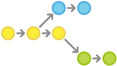

原文链接：[Git Workflows and Tutorials](https://www.atlassian.com/git/workflows)

### :apple: 译序

工作流其实不是一个初级主题，后面本质的问题其实是有效的项目流程和高效的开发协同，而不仅是`Git`和`SVN`工具的使用。

这篇指南以大家在`SVN`中已经广为熟悉使用的集中式工作流开始，循序渐进地发展到高效的分布式工作流，并说明了便利的`Pull Request`配合使用，体系的讲解了各种工作流应用。

行文中实践原则和操作示例并重，对于`Git`的资深玩家可以梳理思考提升，而新接触的同学，一样可以跟着step-by-step操作来学习操练并在实际工作使用。

对于`Git`工作流主题，目前网上资料很少，多是零散地操作说明，希望这篇文章能让你更深入理解并在工作中灵活有效地使用起来。

自己理解粗浅，翻译不合适和不对的地方，欢迎建议（[提交Issue](https://github.com/quickhack/translations/issues))和指正（[Fork后提交代码](https://github.com/quickhack/translations/fork)）！

`Git`工作流指南
======================

:point_right: 工作流有各式各样的用法，但也正因此使得在实际工作中如何上手使用变得很头大。这篇指南为公司团队使用中最常见的几种`Git`工作流提供入门介绍。

在阅读的过程中请记住，这里设计的几种工作流应该是作为方案指导而不是条例规定。在展示了各种工作流可能的用法后，你可以从不同的工作流中挑选或揉合出一个满足你自己需求的工作流。

:beer: 概述
---------------------

### 集中式工作流

如果你的开发团队成员已经很熟悉`Subversion`，集中式工作流让你无需去适应一个全新流程就可以用上`Git`带来的收益。这个工作流也是一个向更`Git`风格工作流迁移的友好过渡。

[了解更多 »](workflow-centralized.md)

### 功能分支工作流

功能分支工作流以集中式工作流为基础，不同的是为各个新功能分配一个单独的分支来开发。这样可以在把新功能合并到正式主干前，用`Pull Requests`的方式讨论变更。

[了解更多 »](workflow-feature-branch.md)

### `Gitflow`工作流

`Gitflow`工作流通过为功能开发、发布准备和维护提供独立的分支，来简化发布迭代过程。严格的分支模型为大型项目提供了一些非常有必要的结构。

[了解更多 »](workflow-gitflow.md)

### `Forking`工作流

`Forking`工作流是分布式工作流，充分利用了`Git`在分支和克隆上的优势。可以安全可靠地管理大团队的开发者（`developer`），并能接受不信任贡献者（`contributor`）的提交。

[了解更多 »](workflow-forking.md)

### `Pull Requests`

`Pull requests`是`Bitbucket`让开发者更方便地进行协作的功能，提供了友好的`Web`界面可以在合并得提交的修改到官方项目之前对修改进行讨论。

[了解更多 »](pull-request.md)

-----------------

　　　　　　　　[集中式工作流 »](workflow-centralized.md)
