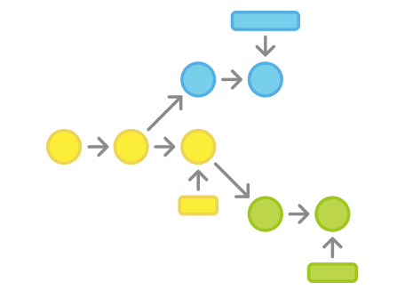

原文链接：[Git Workflows and Tutorials](https://www.atlassian.com/git/workflows)

`Git`工作流
======================

:point_right: 工作流有各式各样的用法，也正因此使得在工作中如何开始使用变得很头大。这篇文章为公司团队使用最常见的`Git`工作流提供入门介绍。

在阅读的过程中请记住，这里设计的几种工作流应该作为指导方案而不是条例规定。在展示了各种工作流可能的用法后，你可以从不同的工作流中挑选或揉合出一个满足你自己需求的工作流。

:beer: 概述
---------------------

### 中心化（Centralized）工作流

如果你的开发团队成员已经很熟悉`Subversion`，中心化工作流让你可以无需去适应一个全新流程就可以使用上`Git`带来的收益。这个工作流也是一个向更`Git`工作流迁移的友好过渡。

[了解更多 »](workflow-centralized.md)

### 功能分支（Feature Branch）工作流

功能分支工作流以中心化工作流为基础，不同的是为各个新功能分配一个单独的分支开发。这样可以在把新功能合并到正式主干前，用`Pull Requests`的方式讨论变更。

[了解更多 »](workflow-feature-branch.md)

### `Gitflow`工作流

`Gitflow`工作流通过为功能开发、发布准备和维护提供独立的分支，来简化发布迭代过程。严格的分支模型为大型项目提供了一些非常有必要的结构。

### `Forking`工作流

`Forking`工作流是分布式工作流，充分利用了`Git`在分支和克隆上的优势。可以安全可靠地管理大团队的开发者（`developer`），并能接受不信任贡献者（`contributor`）的提交。

### `Pull Requests`

`Pull requests`是`Bitbucket`让开发者更方便地进行协作的功能，提供了友好的Web界面可以在合并得提交的修改到官方项目之前对修改进行讨论。

