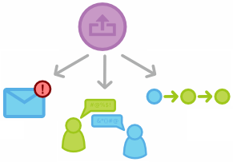

原文链接：[Git Workflows and Tutorials](https://www.atlassian.com/git/workflows)     
译文发在[博乐在线](http://www.jobbole.com/)： [http://blog.jobbole.com/76550/](http://blog.jobbole.com/76843/)，2014-09-14

:apple: 译序
-----------------

工作流其实不是一个初级主题，背后的本质问题其实是有效的项目流程管理和高效的开发协同约定，不仅是`Git`或`SVN`等[`VCS`](http://zh.wikipedia.org/wiki/%E7%89%88%E6%9C%AC%E6%8E%A7%E5%88%B6)或[`SCM`](http://zh.wikipedia.org/wiki/%E8%BD%AF%E4%BB%B6%E9%85%8D%E7%BD%AE%E7%AE%A1%E7%90%86)工具的使用。

这篇指南以大家在`SVN`中已经广为熟悉使用的集中式工作流作为起点，循序渐进地演进到其它高效的分布式工作流，还介绍了如何配合使用便利的`Pull Request`功能，体系地讲解了各种工作流的应用。

行文中实践原则和操作示例并重，对于`Git`的资深玩家可以梳理思考提升，而新接触的同学，也可以跟着step-by-step操作来操练学习并在实际工作中上手使用。

关于`Git`工作流主题，网上体系的中文资料不多，主要是零散的操作说明，希望这篇文章能让你更深入理解并在工作中灵活有效地使用起来。

***PS***：

文中`Pull Request`的介绍用的是`Bitbucket`代码托管服务，由于和`GitHub`基本一样，如果你用的是`GitHub`（我自己也主要使用`GitHub`托管代码），不影响理解和操作。

***PPS***：

本指南循序渐进地讲解工作流，如果`Git`用的不多，可以从前面的讲的工作流开始操练。操作过程去感受指南的讲解：解决什么问题、如何解决问题，这样理解就深了，也方便活用。

`Gitflow`工作流是经典模型，体现了工作流的经验和精髓。随着项目过程复杂化，会感受到这个工作流中深思熟虑和威力！

`Forking`工作流是协作的（`GitHub`风格）可以先看看`Github`的Help：[Fork A Repo](https://help.github.com/articles/fork-a-repo/)和[Using pull requests](https://help.github.com/articles/using-pull-requests/) 。照着操作，给一个`Github`项目贡献你的提交，有操作经验再看指南容易意会。指南中给了[自己实现`Fork`的方法](https://github.com/oldratlee/translations/blob/master/git-workflows-and-tutorials/workflow-forking.md#%E5%BC%80%E5%8F%91%E8%80%85fork%E6%AD%A3%E5%BC%8F%E4%BB%93%E5%BA%93)：`Fork`就是服务端的克隆。在指南的操练中使用代码托管服务（如`GitHub`、`Bitbucket`），可以点一下按钮就让开发者完成仓库的`fork`操作。

:see_no_evil: [自己](http://weibo.com/oldratlee)理解粗浅，翻译中不足和不对之处，欢迎建议（[提交Issue](https://github.com/oldratlee/translations/issues)）和指正（[Fork后提交代码](https://github.com/oldratlee/translations/fork)）！

`Git`工作流指南
======================

:point_right: 工作流有各式各样的用法，但也正因此使得在实际工作中如何上手使用变得很头大。这篇指南通过总览公司团队中最常用的几种`Git`工作流让大家可以上手使用。

在阅读的过程中请记住，本文中的几种工作流是作为方案指导而不是条例规定。在展示了各种工作流可能的用法后，你可以从不同的工作流中挑选或揉合出一个满足你自己需求的工作流。

:beer: 概述
---------------------

### 集中式工作流

如果你的开发团队成员已经很熟悉`Subversion`，集中式工作流让你无需去适应一个全新流程就可以体验`Git`带来的收益。这个工作流也可以作为向更`Git`风格工作流迁移的友好过渡。

[了解更多 »](workflow-centralized.md)

### 功能分支工作流

功能分支工作流以集中式工作流为基础，不同的是为各个新功能分配一个专门的分支来开发。这样可以在把新功能集成到正式项目前，用`Pull Requests`的方式讨论变更。

[了解更多 »](workflow-feature-branch.md)

### `Gitflow`工作流

`Gitflow`工作流通过为功能开发、发布准备和维护分配独立的分支，让发布迭代过程更流畅。严格的分支模型也为大型项目提供了一些非常必要的结构。

[了解更多 »](workflow-gitflow.md)

### `Forking`工作流

`Forking`工作流是分布式工作流，充分利用了`Git`在分支和克隆上的优势。可以安全可靠地管理大团队的开发者（`developer`），并能接受不信任贡献者（`contributor`）的提交。

[了解更多 »](workflow-forking.md)

### `Pull Requests`

`Pull requests`是`Bitbucket`提供的让开发者更方便地进行协作的功能，提供了友好的`Web`界面可以在提议的修改合并到正式项目之前对修改进行讨论。

[了解更多 »](pull-request.md)

-----------------

　　　　　　　　[集中式工作流 »](workflow-centralized.md)
