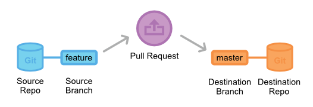
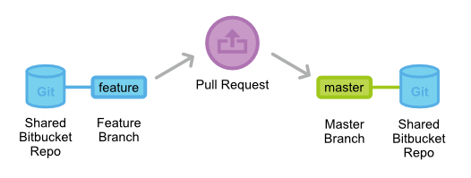
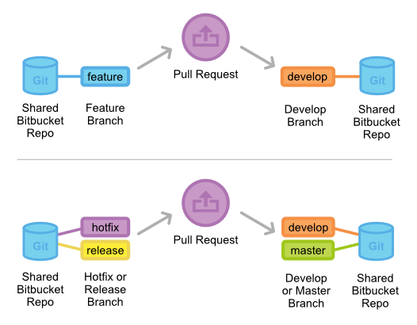

`Pull Request`工作流
=======================

`Pull Requests`是`Bitbucket`上方便开发者之间协作的功能。
提供了一个用户友好的`Web`界面，在集成提交的变更到正式项目前可以对变更进行讨论。

开发者向团队成员通知功能开发已经完成，`Pull Requests`是最简单的用法。
开发者完成功能开发后，通过`Bitbucket`账号发起一个`Pull Request`。
这样让涉及这个功能的所有人知道要去做`Code Review`和合并到`master`分支。

但是，`Pull Request`远不止一个简单的通知，而是一个专门为提交的功能的论坛。
如果变更有任何问题，团队成员反馈在`Pull Request`中，甚至`push`提交微调功能。
在`Pull Request`中，所有的这些活动都直接跟踪了。

相比其它的协作模型，这种分享提交的形式有助于打造一个更流畅的工作流。
`SVN`和`Git`都能通过一个简单的脚本收到通知邮件；但是，讨论变更时，开发者通常只能去回复邮件。
这样做会变得杂乱，尤其还要涉及后面的几个提交时。
`Pull Requests`把所有相关功能整合到一个和`Bitbucket`仓库界面集成的用户友好`Web`界面中。

### 解析`Pull Request`

当要发起一个`Pull Request`，你所要做的就是请求（`Request`）另一个开发者（比如项目的维护者）
来`pull`你仓库中一个分支到他的仓库中。这意味着你要提供4个信息以发起`Pull Request`：
源仓库、源分支、目的仓库、目的分支。

这几值多数`Bitbucket`会设置合适的缺省值。但取决你用的协作工作流，你的团队可能会指定不同的值。
上图显示了一个`Pull Request`请求合并一个功能分支到正式的`master`分支上，但可以有多种不同的`Pull Request`用法。

:beer: 工作方式
---------------------

`Pull Request`可以和[功能分支工作流](workflow-feature-branch.md)、[`Gitflow`工作流](workflow-gitflow.md)或[`Forking`工作流](workflow-forking.md)一起使用。
但一个`Pull Request`需求要么分支不同要么仓库不同，所以不能用于[集中式工作流](workflow-centralized.md)。
在不同的工作流中使用`Pull Request`会稍许不同，但基本的过程是这样的：

1. 开发者在本地仓库中新建一个专门的分支开发功能。
1. 开发者`push`分支修改到公开的`Bitbucket`仓库中。
1. 开发者通过`Bitbucket`发起一个`Pull Request`。
1. 团队的其它成员`review` `code`，讨论并修改。
1. 项目维护者合并功能到官方仓库中并关闭`Pull Request`。

本方后面内容说明，`Pull Request`如何在不同协作工作流应用。

### 在功能分支工作流中使用`Pull Request`

功能分支工作流用一个共享的`Bitbucket`仓库来管理协作，开发者在专门的分支上开发功能。
但不是合并到`master`分支上，而是在合并到主代码库之前开发者应该开一个`Pull Request`发起功能的讨论。

功能分支工作流只有一个公有的仓库，所以`Pull Request`的目的仓库和源仓库总是同一个。
通常开发者会指定他的功能分支作为源分支，`master`分支作为目的分支。

收到`Pull Request`后，项目维护者要决定如何做。如果功能没问题，就简单地合并到`master`分支，关闭`Pull Request`。
但如果提交的变更有问题，他可以在`Pull Request`中反馈。之后新加的提交也会评论之后接着显示出来。

在功能还没有完全开发完的时候，也可能发起一个`Pull Request`。
比如开发者在实现某个需求时碰到了麻烦，他可以发一个包含正在进行中工作的`Pull Request`。
其它的开发者可以在`Pull Request`提供建议，或者甚至直接添加提交来解决问题。

### 在`Gitflow`工作流中使用`Pull Request`

`Gitflow`工作流和功能分支工作流类似，但围绕项目发布定义一个严格的分支模型。
在`Gitflow`工作流中使用`Pull Request`让开发者在工作时可以有个方便的地方关于发布分支或是维护分支进行交流。

`Gitflow`工作流中`Pull Request`的使用过程和上一节中完全一致：
当一个功能、发布或是热修复分支需要`Review`时，开发者简单发起一个`Pull Request`，
团队的其它成员会通过`Bitbucket`收到通知。

新功能一般合并到`develop`分支，而发布和热修复则要同时合并到`develop`分支和`master`分支上。
`Pull Request`可能用做所有合并的正式管理。

### 在`Forking`工作流中使用`Pull Request`

在`Forking`工作流中，开发者`push`完成的功能到他自己的仓库中，而不是共享仓库。
然后，他发起一个`Pull Request`，让项目维护者知道他的功能已经可以`Review`了。

在这个工作流，`Pull Request`的通知功能非常有用，
因为项目维护者不可能知道其它开发者在他们自己的仓库添加了提交。

由于各个开发有自己的分开仓库，`Pull Request`的源仓库和目标仓库不是同一个。
源仓库是开发者的公开仓库，源分支是包含了修改的分支。
如果开发者要合并修改到正式代码库中，那么目标仓库是正式仓库，目标分支是`master`分支。

`Pull Request`也可以用于正式项目之外的其它开发之前的协作。
比如，如果一个开发者和一个团队成员一起开发一个功能，他们可以发起一个`Pull Request`，
用团队成员的`Bitbucket`仓库作为目标，而不是正式项目的仓库。
然后使用相同的功能分支作为源和目标分支。

2个开发者之间可以在`Pull Request`中讨论和开发功能。
完成开发后，他们可以另一个`Pull Request`，请求合并功能到正式的`master`分支。
在`Forking`工作流中，这样的灵活性让`Pull Request`成为一个强有力的协作工具。

:beer: 示例
---------------------

-----------------

[« `Forking`工作流](workflow-forking.md)　　　　　　　　　　　　　　　　　　　　　　　　　　　　[概述 »](README.md)
