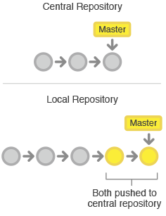
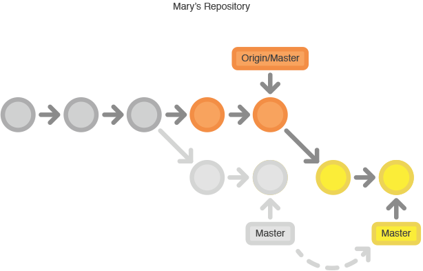

集中式工作流
=================================


转到分布式版本控制系统看起来像个吓人的任务，但不需要改变你已有流程就可以用上Git的好处。你的团队可以用和`Subversion`完全不变的方式来开发项目。

但用上`Git`可以比`SVN`在开发流程上有所改进。首先，每个开发可以有自己的是整个工程拷贝的本地分支。隔离的环境让各个开发者的工作独立于项目其它修改的 ——
即自由地提交到自己的本地仓库，先完全忽略上游的开发，走到合适的时候把修改反馈给他们。

其次，`Git`提供了强壮的分支和合并模型。不像`SVN`，`Git`的分支设计成可以做为一种『失败安全』的机制，用来集成代码和分享仓库间的修改。

:beer: 工作方式
---------------------

像`Subversion`一样，集中式工作流以中央仓库作为项目所有修改的单点实体。相比`SVN`缺省的开发分支`trunk`，`Git`是`master`，所有修改提交到这个分支上。这种工作流只用到`master`这一个分支。

开发者开始先克隆中央仓库。在自己的项目拷贝中像`SVN`一样的编辑文件和提交修改；但修改是存在本地的，和中央仓库是完全隔离的。把和上游的同步延后到一个方便时间点。

要发布修改到正式项目中，开发者执行`push`操作，把本地`master`分支的修改『推』到中央仓库中。这相当于`svn commit`操作，但`push`操作会把所有还不在中央仓库的本地提交都推上去。



:beer: 冲突解决
---------------------

中央仓库代表了正式项目，所以提交历史应该被尊重且稳定不变的。如果开发者本地的提交历史和中央仓库有分歧，`Git`会拒绝修改提交否则会覆盖已经在中央库的提交。


在开发者发布自己功能修改前，需要先`fetch`在中央库的提交，`rebase`自己提交到中央库提交历史之上。
这样做的意思是在说，『我要把自己的修改加到别人已经完成的修改上。』最终的结果是一个完美的线性历史，就像以前的`SVN`的工作流中一样。

如果本地修改和上游提交有冲突，`Git`会暂停`rebase`过程，给你手动解决冲突的机会。`Git`解决合并冲突，用和生成提交一样的[`git status`](https://www.atlassian.com/git/tutorial/git-basics#!status)和[`git add`](https://www.atlassian.com/git/tutorial/git-basics#!add)命令，方便让新开发同学来解决自己的合并。当然，如果解决冲突时遇到麻烦，`Git`可以很简单中止整体`rebase`操作，再重来（或者让别人来帮助解决）。

:beer: 示例
---------------------

让我们一起逐步分解来看看一个典型的小团队如何用这个工作流来协作的。有2个开发者小明和小红，看看他们是如何开发自己的功能并提交到中央仓库上的。

### 有个人初始化好中央仓库


第一步，有个人在服务器上要创建中央仓库。如果是新项目，你可以初始化一个空仓库；否则你要导入已有的`Git`或`SVN`仓库。

中央仓库应该是个裸仓库（`bare repository`），即没有工作目录（working directory）的仓库。可以这样创建：

```bash
ssh user@host
git init --bare /path/to/repo.git
```

确保写上有效的`user`（`SSH`的用户名），`host`（服务器的域名或IP地址），`/path/to/repo.git`（你想存放仓库的位置）。注意，按照约定加上`.git`扩展名到仓库名上，以表示这是一个裸仓库。

### 所有人克隆中央仓库


下一步，各个开发者创建整个项目的本地拷贝。通过[`git clone`](https://www.atlassian.com/git/tutorial/git-basics#!clone)命令完成：

```bash
git clone ssh://user@host/path/to/repo.git
```

克隆好仓库，`Git`会自动添加短别名`origin`指回『父』仓库，这是基于你后续会持续和它交互的假设。

### 小明开发功能


在小明的本地仓库中，他使用标准的`Git`过程开发功能：编辑、暂存（`Stage`）和提交。
如果你不熟悉暂存区，简单的说它其实是可以不用把工作目录中所有的修改都提交掉的一个方法。这样你可以创建一个聚焦的提交，尽管你本地修改很多内容。

```bash
git status # 查看本地仓库的修改状态
git add # 暂存文件
git commit # 提交文件
```

请记住，因为这些命令生成的是本地提交，小明可以按自己需求操作多次，而不用担心中央仓库上有过什么操作。对需要分解成多个更简单更原子分块的大功能，这个做法是很有用的。


### 小红开发功能


与此同时，小红在自己的本地仓库中用相同的编辑、暂存和提交过程开发功能。和小明一样，她也不关心在中央仓库在做什么操作；
当然更不关心小明在他的本地仓库中的操作，因为所有本地仓库都是私有的。

### 小明发布功能


一旦小明完成了他的功能开发，会发布他的本地提交到中央仓库中，这样其它团队成员可以看到他的修改。他可以用下面的`git push`命令：

```bash
git push origin master
```

`origin`是在小明克隆仓库时`Git`创建的远程中央仓库名字。`master`参数告诉`Git`推送的分支。
由于中央仓库自从小明克隆以来还没有被更新过，所以`push`操作不会有冲突，成功完成。

### 小红试着发布功能


一起来看看在小明发布修改后，小红`push`修改会怎么样？她使用一样的`push`命令：

```bash
git push origin master
```

但她的本地历史已经和中央仓库分岐了，`Git`拒绝操作并给出下面很长的出错消息：

```
error: failed to push some refs to '/path/to/repo.git'
hint: Updates were rejected because the tip of your current branch is behind
hint: its remote counterpart. Merge the remote changes (e.g. 'git pull')
hint: before pushing again.
hint: See the 'Note about fast-forwards' in 'git push --help' for details.
```

这避免了小红覆写正式的提交。她要先`pull`小明的更新到她的本地仓库合并上她的本地修改后，再重试。

### 小红在小明的提交之上`rebase`


小红用`git pull`合并上游的修改到自己的仓库中。这条命令类似`svn like`——拉取所有上游提交命令到小红的本地仓库，并尝试和她的本地修改合并：

```bash
git pull --rebase origin master
```

`--rebase`选项让`Git`把小红的提交移到 同步了中央仓库修改后的`master`分支的顶部，如下图所示：



如果你忘加了这个选项，`pull`操作仍然可以完成，但每次`pull`操作要同步别人修改时，提交历史会以一个多余的『合并提交』结尾。
对于集中式工作流，最好是使用`rebase`而不是生成一个合并提交。

### 小红解决合并冲突


`rebase`所做的操作是把本地提交一次一个地迁移到更新中央仓库提交的`master`分支上。
这意味着可能要解决在迁移某个提交时出现的合并冲突，而不是解决包含所有提交的大型合并所出现的冲突。
这样的方式需要你尽可能保持每个提交的聚焦和项目历史的整洁。反过来，这简化了哪里引入Bug的分析，如果有必要，回滚修改也可以对项目影响最小。

如果小红和小明的功能是相关的，不可能在`rebase`过程中有冲突。如果有，`Git`在合并有冲突的提交处暂停`rebase`过程，输出下面的信息并带上相关的指令：

```
CONFLICT (content): Merge conflict in <some-file>
```


`Git`很赞的一点是，可以任何人可以解决自己的冲突。在这个例子中，小红可以简单的运行`git status`命令来查看哪里有问题。
冲突文件列在`Unmerged paths`（未合并路径）一节中：

```
# Unmerged paths:
# (use "git reset HEAD <some-file>..." to unstage)
# (use "git add/rm <some-file>..." as appropriate to mark resolution)
#
# both modified: <some-file>
```

小红编辑这些文件。修改完成后，用老方法暂存这些文件，并让`git rebase`完成剩下的事：

```bash
git add <some-file> 
git rebase --continue
```

这就好了，`Git`会断续一个一个合并后面的提交，如其它的提交有冲突会重复这个过程。

如果你碰到了冲突，但发现搞不定，不要惊慌。只要执行下面这条命令，就可以回到你执行`git pull --rebase`命令前的样子：

```bash
git rebase --abort
```

### 小红成功发布功能


小红完成中央仓库的同步后，就能成功发布她的修改了：

```bash
git push origin master
```

:beer: 下一站
-----------------

如你所见，仅使用几个`Git`命令就我们就可以模拟传统`Subversion`开发环境。对于要从`SVN`迁移的团队来说这太好了，但这没有发挥出`Git`分布式本质。

如果你的团队适应了集中式工作流，并想更流畅的协作效果，绝对值得探索一下[功能分支工作流](workflow-feature-branch.md)。
通过为一个功能分配一个隔离分支，使得一个新增功能集成到正式项目前对新功能进行深入讨论成为可能。

-----------------

[« Overview](README.md)　　　　　　　　　　　　　　　　　　　　　　　　　　　　　　　　　[功能分支工作流 »](workflow-feature-branch.md)
