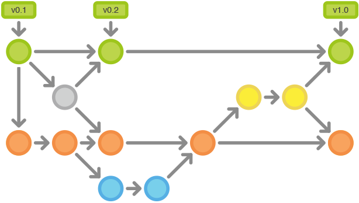

`Gitflow`工作流
============================



这节介绍的[`Gitflow`工作流](http://nvie.com/posts/a-successful-git-branching-model/)借鉴自在[nvie](http://nvie.com/)的*Vincent Driessen*。

`Gitflow`工作流定义了一个用于解决项目发布的严格分支模型。相应地也比[功能分支工作流](workflow-feature-branch.md)复杂几分，提供了管理大型项目的一个健壮的框架。

这个工作流没有比功能分支工作流有新的概念和命令。而是为不同的分支分配一个很明确的角色，并定义如何和什么时候分支要交互。
比起功能分支工作流，使用为做准备、维护和记录发布使用各自的分支。当然你也用上功能分支工作流所有的好处：`Pull Requests`、隔离实验性开发和更高效的协作。

:beer: 工作方式
---------------------

`Gitflow`工作流仍然用中央仓库作为所有开发者的交互中心。和其它的工作流一样，开发者在本地工作并`push`到要中央仓库中。

### 历史分支

相对使用仅有一个`master`分支，本工作流使用2个分支记录项目的历史。`master`分支存储了正式发布的历史，而`develop`分支作为功能的集成分支。
这样也方便`master`分支上的所有提交分配一个版本号。


剩下要说明的问题围绕着这2个分支的区别展开。

### 功能分支

每个新功能属于一个自己的分支，这样可以[`push`到中央仓库以备份和协作](https://www.atlassian.com/git/tutorial/remote-repositories#!push)。
但功能分支不是从`master`分支上拉出新分支，而是使用`develop`分支作为父分支。当新功能完成时，合并回`develop`分支。功能应该从不直接到`master`分支交互。


注意，从含义和目的上来看，功能分支加上`develop`分支是功能分支工作流的用法。但`Gitflow`工作流没有在这里止步。

### 发布分支


一旦`develop`分支上有了做一次发布（或者说快到了既定的发布日）的足够功能，就从`develop`分支上`fork`一个发布分支。
新建的分支用于开始下一轮的开发循环，之后新的功能不能再加到这个分支上，这个分支只应该做`Bug`修复、文档生成和其它面向发布任务。
一旦对外发布的工作都完成了，发布分支合并到`master`分支并分配一个版本号打好`Tag`。
另外，这些从新建发布分支以来的做的修改要合并回`develop`分支。

使用一个做准备分布的专门分支，使得一个团队可以在完善当前的发布版本，同时另一个团队继续开发下个版本的功能。
这也打造定义良好的开发阶段（比如，可以很轻松地说，『这周我们要做准备发布版本4.0』，并且在仓库的目录结构中可以真实地看到）。

一般的分支约定：

```
用于新建发布分支的分支: develop
用于合并的分支: master
分支命名: release-* or release/*
```

### 维护分支


维护分支或说是热修复（`hotfix`）分支用于生成快速给发布版本打补丁，是唯一可以从`master`分支`fork`出来的分支。
一旦修复完成，修改要合并回`master`分支和`develop`分支（当前的发布分支），`master`分支应该用新的版本号打好`Tag`。

为`Bug`修复使用专门线路，让团队处理问题而不用打断其它工作或等待下一个发布循环。
你可以把维护分支想成一个直接基于`master`分支的暂时分布。

:beer: 示例
---------------------

下面的示例演示本工作流如何用于管理单个发布循环。假设你已经创建了一个中央仓库。

### 创建开发分支


第一步为`master`分支配套一个`develop`分支。简单来做可以[本地创建一个空的`develop`分支](https://www.atlassian.com/git/tutorial/git-branches#!branch)，`push`到服务器上：

```bash
git branch develop
git push -u origin develop
```

这个分支包含了项目的全部历史，而`master`分支包含了删减版的历史。然后其它开发者应该克隆中央仓库，建好`develop`分支的跟踪分支：

```bash
git clone ssh://user@host/path/to/repo.git
git checkout -b develop origin/develop
```

现在每个开发都有了历史分支的本地拷贝。

### 小红和小明开始开发新功能


这个示例中，小红和小明开始各自的功能开发。他们需要为各自的功能创建相应的分支。各自的新分支不是基于`master`分支，而是应该[基于`develop`分支](https://www.atlassian.com/git/tutorial/git-branches#!checkout)：

```bash
git checkout -b some-feature develop
```

他们用老套路添加提交到各自功能分支上：编辑、暂存、提交：
```bash
git status
git add <some-file>
git commit
```

### 小红完成功能开发


添加了提交后，小红觉得她的功能OK了。如果团队使用`Pull Requests`，是个合适的时候发起一个合并到`develop`分支。
否则她可以直接合并到她本地的`develop`分支后`push`到中央仓库：

```bash
git pull origin develop
git checkout develop
git merge some-feature
git push
git branch -d some-feature
```

第一条命令在合并功能前确保`develop`分支是最新的。注意，功能决不应该直接合并到`master`分支。
冲突解决方法像[集中式工作流](workflow-centralized.md)一样。

### 小红开始准备发布


这个时候小明正在实现他的功能，小红开始准备她的第一个项目正式发布。
像功能开发一样，她用一个新分支来完成发布准备。这一步也确定了发布的版本号：

```bash
git checkout -b release-0.1 develop
```

这个分支是清理发布、执行所有测试、更新文档和其它为下个发布做准备操作的地方。像是一个专门用于改善发布的功能分支。

只要小红创建这个分支并`push`到中央仓库，这个发布就是功能冻结的。任何不在`develop`分支中的新功能都推到下个发布循环中。

### 小红完成发布


一旦可以对外发布，小红合并修改到`master`分支和`develop`分支上，删除发布分支。合并回`develop`分支很重要，因为在发布分支中已经提交的更新需要在新功能中也有的。
另外，如果小红的团队要求`Code Review`，这是一个发起`Pull Request`的理想时机。

```bash
git checkout master
git merge release-0.1
git push
git checkout develop
git merge release-0.1
git push
git branch -d release-0.1
```

发布分支是作为功能开发（`develop`分支）和对外发布（`master`分支）间的缓冲。只要有合并到`master`分支，就应该打好`Tag`以方便跟踪。

```bash
git tag -a 0.1 -m "Initial public release" master
git push --tags
```

`Git`有提供勾子（`hook`），即仓库有事件发生时触发执行的脚本。
可以配置勾子，在你`push`中央仓库的`master`分支时，自动执行对外发布的构建。

### 最终用户发现`Bug`


对外发布后，小红回去和小明一起做下个发布的新功能开发，直到有最终用户开了一个`Ticket`抱怨当前版本的一个`Bug`。
为了处理`Bug`，小红（或小明）从`master`分支上拉出了一个维护分支，提交修改以解决问题，然后直接合并回`master`分支：

```bash
git checkout -b issue-#001 master
# Fix the bug
git checkout master
git merge issue-#001
git push
```

就像发布分支，维护分支中新加重要修改需要合到`develop`分支中，所以小红要执行一个合并操作。然后就可以安全地删除这个分支了：

```bash
git checkout develop
git merge issue-#001
git push
git branch -d issue-#001
```

:beer: 下一站
-----------------

到了这里，但愿你已经对[集中式工作流](workflow-centralized.md)、[功能分支工作流](workflow-feature-branch.md)和`Gitflow`工作流感觉很舒适了。
你应该牢固的掌握了本地仓库的潜能，`push`/`pull`模式和`Git`健壮的分支和合并模型。

记住，这里展示的工作流只是可能用法的例子，而不是在实际工作中使用`Git`不可违逆的条例。所以不要畏惧去接受或忽略另一个工作流的某些用法。
不变的目标就是让`Git`为你所用。

-----------------

[« 功能分支工作流](workflow-feature-branch.md)　　　　　　　　　　　　　　　　　　　　　　　　　　　　　　　　[`Forking`工作流 »](workflow-forking.md)
