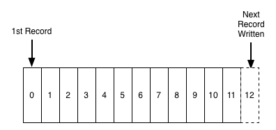
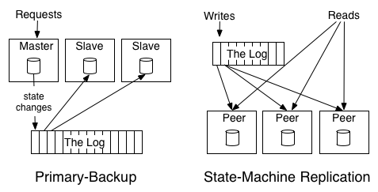

第一部分：日志是什么？
=====================================================================

1. [数据库中的日志](#数据库中的日志)
1. [分布式系统中的日志](#分布式系统中的日志)
1. [变更日志101：表与事件的二相性（`duality`）](#变更日志101表与事件的二相性duality)
1. [接下来的内容](#接下来的内容)

日志可能是一种最简单的不能再简单的存储抽象，只能追加、按照时间完全有序（`totally-ordered`）的记录序列。日志看起来的样子：

在日志的末尾添加记录，读取日志记录则从左到右。每一条记录都指定了一个唯一的顺序的日志记录编号。

日志记录的次序（`ordering`）定义了『时间』概念，因为位于左边的日志记录表示比右边的要早。
日志记录编号可以看作是这条日志记录的『时间戳』。
把次序直接看成是时间概念，刚开始你会觉得有点怪异，但是这样的做法有个便利的性质：解耦了 时间 和 任一特定的物理时钟（`physical clock`）。
引入分布式系统后，这会成为一个必不可少的性质。

**_【译注】_** 分布式系统的 时间、次序、时钟是个最基础根本的问题，详见被引用最多的_Leslie Lamport_的论文**_Time Clocks and the Ordering of Events in a Distributed System_**（[中文翻译](http://duanple.blog.163.com/blog/static/709717672012920101343237/)），现在先 **_不要_** 去看，除非读完本文后你还是有很兴趣要探个明白！

日志记录的内容和格式是什么对于本文讨论并不重要。另外，不可能一直给日志添加记录，因为总会耗尽存储空间。稍后我们会再回来讨论这个问题。

所以，日志 和 文件或数据表（`table`）并没有什么大的不同。文件是一系列字节，表是由一系列记录组成，而日志实际上只是一种按照时间顺序存储记录的数据表或文件。

讨论到现在，你可能奇怪为什么要讨论这么简单的概念？只能追加的有序的日志记录究竟又是怎样与数据系统生产关系的？
答案是日志有其特定的目标：它记录了什么时间发生了什么事情。而对分布式数据系统，在许多方面，这是要解决的问题的真正核心。

不过，在我们进行更加深入的讨论之前，让我先澄清有些让人混淆的概念。每个程序员都熟悉另一种日志记录的定义 —— 应用使用`syslog`或者`log4j`写入到本地文件里的无结构的错误信息或者追踪信息。为了区分，这种情形的称为『应用日志记录』。
应用日志记录是我说的日志概念的一种退化。两者最大的区别是：文本日志意味着主要用来方便人去阅读，而构建我所说的『日志（`journal`）』或者『数据日志（`data logs`）』是用于程序的访问。

（实际上，如果你深入地思考一下，会觉得人去阅读某个机器上的日志这样的想法有些落伍过时了。
当涉及很多服务和服务器时，这样的做法很快就变得难于管理，
我们的目的很快就变成 输入查询 和 输出用于理解多台机器的行为的图表，
因此，文件中的字句文本 几乎肯定不如 本文所描述的结构化日志 更合适。）

数据库中的日志
-------------------------

我不知道日志概念的起源 —— 可能就像二分查找（`binary search`）一样，发明者觉得太简单了而不是一项发明。早在`IBM`的[系统R](http://www.cs.berkeley.edu/~brewer/cs262/SystemR.pdf)出现时候日志就出现了。
在数据库里的用法是在崩溃的时候用它来保持各种数据结构和索引的同步。为了保证操作的原子性（`atomic`）和持久性（`durable`)，
在对数据库维护的所有各种数据结构做更改之前，数据库会把要做的更改操作的信息写入日志。
日志记录了发生了什么，而每个表或者索引都是更改历史中的一个投影。由于日志是立即持久化的，发生崩溃时，可以作为恢复其他所有持久化结构的可靠来源。

随着时间的推移，日志的用途从`ACID`的实现细节成长为数据库间复制数据的一种方法。
结果证明，发生在数据库上的更改序列 即是 与远程副本数据库（`replica database`）保持同步 所需的操作。
`Oracle`、`MySQL` 和`PostgreSQL`都包括一个日志传送协议（`log shipping protocol`），传输日志给作为备库（`Slave`）的复本（`replica`）数据库。
`Oracle`还把日志产品化为一个通用的数据订阅机制，为非`Oracle`数据订阅用户提供了[`XStreams`](http://docs.oracle.com/cd/E11882_01/server.112/e16545/xstrm_intro.htm)和[`GoldenGate`](http://www.oracle.com/technetwork/middleware/goldengate/overview/index.html)，在`MySQL`和`PostgreSQL`中类似设施是许多数据架构的关键组件。

正是由于这样的起源，机器可识别的日志的概念主要都被局限在数据库的内部。日志作为做数据订阅机制的用法似乎是偶然出现的。
但这正是支持各种的消息传输、数据流和实时数据处理的理想抽象。

分布式系统中的日志
-------------------------

日志解决了两个问题：更改动作的排序和数据的分发，这两个问题在分布式数据系统中更是尤为重要。
协商达成一致的更改动作的顺序（或是协商达成不一致做法并去做有副作用的数据拷贝）是分布式系统设计的核心问题之一。

分布式系统以日志为中心的方案是来自于一个简单的观察，我称之为**状态机复制原理**（`State Machine Replication Principle`）：

**如果两个相同的、确定性的进程从同一状态开始，并且以相同的顺序获得相同的输入，那么这两个进程将会生成相同的输出，并且结束在相同的状态。**

听起来有点难以晦涩，让我们更加深入的探讨，弄懂它的真正含义。

[确定性](http://en.wikipedia.org/wiki/Deterministic_algorithm)（`deterministic `）意味着处理过程是与时间无关的，而且不让任何其他『带外数据（`out of band`）』的输入影响处理结果。
例如，如果一个程序的输出会受到线程执行的具体顺序影响，或者受到`getTimeOfDay`调用、或者其他一些非重复性事件的影响，那么这样的程序一般被认为是非确定性的。

进程**_状态_** 是进程保存在机器上的任何数据，在进程处理结束的时候，这些数据要么保存在内存里，要么保存在磁盘上。

当碰到以相同的顺序输入相同的内容的情况时，应该触发你的条件反射：这个地方要引入日志。
下面是个很直觉的意识：如果给两段确定性代码相同的日志输入，那么它们就会生产相同的输出。

应用到分布式计算中就相当明显了。你可以把用多台机器都执行相同事情的问题化简为实现用分布式一致性日志作为这些处理的输入的问题。
这里日志的目的是把所有非确定性的东西排除在输入流之外，以确保处理这些输入的各个复本（`replica`）保持同步。

当你理解了这个以后，状态机复制原理就不再复杂或深奥了：这个原理差不多就等于说的是『确定性的处理过程就是确定性的』。不管怎样，我认为它是分布式系统设计中一个更通用的工具。

这样方案的一个美妙之处就在于：用于索引日志的时间戳 就像 用于保持副本状态的时钟 —— 你可以只用一个数字来描述每一个副本，即这个副本已处理的最大日志记录的时间戳。
日志中的时间戳 一一对应了 副本的完整状态。

根据写进日志的内容，这个原理可以有不同的应用方式。举个例子，我们可以记录一个服务的输入请求日志，或者从请求到响应服务的状态变化日志，或者服务所执行的状态转换命令的日志。
理论上来说，我们甚至可以记录各个副本执行的机器指令序列的日志 或是 所调用的方法名和参数序列的日志。
只要两个进程用相同的方式处理这些输入，这些副本进程就会保持一致的状态。

对日志用法不同群体有不同的说法。数据库工作者通常说成**_物理_**日志（`physical logging`）和**_逻辑_**日志（`logical logging`）。物理日志是指记录每一行被改变的内容。逻辑日志记录的不是改变的行而是那些引起行的内容改变的`SQL`语句（`insert`、`update`和`delete`语句）。

分布式系统文献通常把处理和复制（`processing and replication`）方案宽泛地分成两种。『状态机器模型』常常被称为主动-主动模型（`active-active model`），
记录输入请求的日志，各个复本处理每个请求。
对这个模型做了细微的调整称为『主备模型』（`primary-backup model`），即选出一个副本做为`leader`，让`leader`按请求到达的顺序处理请求，并输出它请求处理的状态变化日志。
其他的副本按照顺序应用`leader`的状态变化日志，保持和`leader`同步，并能够在`leader`失败的时候接替它成为`leader`。

为了理解两种方式的差异，我们来看一个不太严谨的例子。假定有一个要复制的『算法服务』，维护一个独立的数字作为它的状态（初始值为0），可以对这个值进行加法和乘法运算。
主动-主动方式所做的可能的是输出所进行的变换的日志，比如『+1』、『\*2』等。各个副本都会应用这些变换，从而经过一系列相同的值。
而主备方式会有一个独立的`Master`执行这些变换并输出结果日志，比如『1』、『3』、『6』等。
这个例子也清楚的展示了为什么说顺序是保证各副本间一致性的关键：加法和乘法的顺序的改变将会导致不同的结果。

分布式日志可以看作是建模[一致性](https://en.wikipedia.org/wiki/Consensus_(computer_science))（`consensus`）问题的数据结构。
因为日志代表了『下一个』追加值的一系列决策。
你需要眯起眼睛才能从[`Paxos`](http://en.wikipedia.org/wiki/Paxos_(computer_science))算法簇中找到日志的身影，尽管构建日志是它们最常见的实际应用。
`Paxos`通过称为`multi-paxos`的一个扩展协议来构建日志，把日志建模为一系列一致性值的问题，日志的每个记录对应一个一致性值。
日志的身影在[`ZAB`](http://www.stanford.edu/class/cs347/reading/zab.pdf)、[`RAFT`](https://ramcloud.stanford.edu/wiki/download/attachments/11370504/raft.pdf)和[`Viewstamped Replication`](http://pmg.csail.mit.edu/papers/vr-revisited.pdf)等其它的协议中明显得多，这些协议建模的问题直接就是维护分布式一致的日志。

个人有一点感觉，在这个问题上，我们的思路被历史发展有些带偏了，可能是由于过去的几十年中，分布式计算的理论远超过了其实际应用。
在现实中，一致性问题是有点被过于简单化了。计算机系统几乎不需要决定单个的值，要的是处理一序列的请求。
所以，日志而不是一个简单的单值寄存器，是更自然的抽象。

此外，对算法的专注掩盖了系统底层所需的日志抽象。
个人觉得，我们最终会更关注把日志作为一个商品化的基石而不是考虑它的实现，就像我们经常讨论哈希表而不纠结于它的细节，
比如使用线性探测的杂音哈希（`the murmur hash with linear probing`）还是某个变种。
日志将成为一种大众化的接口，可以有多种竞争的算法和实现，以提供最好的保证和最佳的性能。

变更日志101：表与事件的二相性（`duality`）
-------------------------

让我们继续聊一下数据库。变更日志 和 表之间有着迷人的二相性。
日志类似借贷清单和银行处理流水，而数据库表则是当前账户的余额。如果有变更日志，你就可以应用这些变更生成数据表并得到当前状态。
表记录的是每条数据的最后状态（日志的一个特定时间点）。
可以认识到日志是更基本的数据结构：日志除了可用来创建原表，也可以用来创建各类衍生表。
（是的，表可以是非关系型用户用的键值数据存储（`keyed data store`）。）

这个过程也是可逆的：如果你对一张表进行更新，你可以记录这些变更，并把所有更新的『变更日志（`changelog`）』发布到表的状态信息中。
这些变更日志正是你所需要的支持准实时的复制。
基于此，你就可以清楚的理解表与事件的二相性： 表支持了静态数据，而日志记录了变更。日志的魅力就在于它是变更的_完整_记录，它不仅仅包含了表的最终版本的内容，
而且可以用于重建任何存在过其它版本。事实上，日志可以看作是表**_每个_**历史状态的一系列备份。

这可能会让你想到源代码的版本控制（`source code version control`）。源码控制和数据库之间有着密切的关系。
版本管理解决了一个和分布式数据系统要解决的很类似的问题 —— 管理分布式的并发的状态变更。
版本管理系统建模的是补丁序列（`the sequence of patches`），实际上这就是日志。
你可以检出当前的代码的一个『快照』并直接操作，这个代码快照可以类比成表。
你会注意到，正如有状态的分布式系统一样，版本控制系统通过日志来完成复制：更新代码即是拉下补丁并应用到你的当前快照中。

从销售日志数据库的公司[`Datomic`](http://www.datomic.com/)那里，大家可以看到一些这样的想法。
[这个视频](https://www.youtube.com/watch?v=Cym4TZwTCNU)比较好地介绍了他们如何在系统中应用这些想法。
当然这些想法不是只专属于这个系统，这十多年他们贡献了很多分布式系统和数据库方面的文献。

这节的内容可能有点理论化了。但别沮丧！后面马上就是实操的干货。

接下来的内容
-------------------------

本文剩下的内容，我会试着重点讲述，除了作为分布式计算内部实现或模型抽象，日志有什么优点。包含：

1. _数据集成_（`Data Integration`） —— 让组织中所有存储和处理系统可以容易地访问组织所有的数据。
1. _实时数据处理_ —— 计算生成的数据流。
1. _分布式系统设计_ —— 如何通过集中式日志的设计来简化实际应用系统。

所有这些用法都是通过把日志用做单独服务来实现的。

上面这些场景中，日志的好处都来自日志所能提供的简单功能：生成持久化的可重放的历史记录。
令人意外的是，能让多台机器以确定性的方式（`deterministic manner`）按各自的速度重放历史记录的能力是这些问题的核心。

-----------------

[« 概述](README.md)　　　　[第二部分：数据集成 »](part2-data-integration.md)
