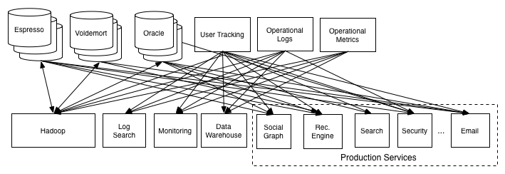
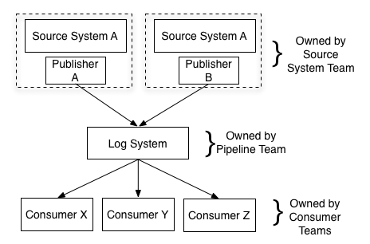
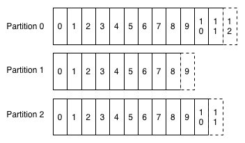

第二部分：数据集成
================================

请让我首先解释 一下“数据集成”是什么意思，还有为什么我觉得它很重要，之后我们再来看看它和日志有什么关系。

数据集成就是将数据组织起来，使得在与其有关的服务和系统中可以访问它们。“数据集成”（data integration）这个短语应该不止这么简单，但是我找不到一个更好的解释。而更常见的术语 ETL 通常只是覆盖了数据集成的一个有限子集(译注：ETL，Extraction-Transformation-Loading的缩写，即数据提取、转换和加载)——相对于关系型数据仓库。但我描述的东西很大程度上可以理解为，将ETL推广至实时系统和处理流程。

你一定不会听到数据集成就兴趣盎然屏住呼吸，并且天花乱坠的想到关于大数据的概念，不过，我相信世俗的问题“让数据可被访问” 是一个组织应该关注的有价值的事情。

对数据的高效使用遵循一种  [马斯洛的需要层次理论](http://en.wikipedia.org/wiki/Maslow%27s_hierarchy_of_needs) 。金字塔的基础部分包括捕获所有相关数据，能够将它们全部放到适当的处理环境（那个环境应该是一个奇妙的实时查询系统，或者仅仅是文本文件和python脚本）。这些数据需要以统一的方式建模，这样就可以方便读取和数据处理。如果这种以统一的方式捕获数据的基本需求得到满足，那么就可以在基础设施上以若干种方法处理这些数据——映射化简（MapReduce），实时查询系统，等等。

很明显，有一点值得注意：如果没有可靠的、完整的数据流，Hadoop集群除了象昂贵的且难于安装的空间取暖器哪样外不会做更多事情了。一旦数据和处理可用，人们就会关心良好数据模型和一致地易于理解的语法哪些更细致的问题。最后，人们才会关注更加高级的处理-更好的可视化、报表以及处理和预测算法。 

以我的经验，大多数机构在数据金字塔的底部存在巨大的漏洞-它们缺乏可靠的、完整的数据流-而是打算直接跳到高级数据模型技术上。这样做完全是反着来做的。

因此，问题是我们如何构建通过机构内所有数据系统的可靠的数据流。

数据集成:两个并发症
----------------------

两种趋势使数据集成变得更困难。

### 事件数据管道

第一个趋势是增长的事件数据(event data)。事件数据记录的是发生的事情，而不是存在的东西。在web系统中，这就意味着用户活动日志，还有为了可靠的操作以及监控数据中心的机器的目的，所需要记录的机器级别的事件和统计数字。人们倾向称它们为“日志数据”，因为它们经常被写到应用的日志中，但是这混淆了形式与功能。这种数据位于现代web的中心：归根结底，Google的资产是由这样一些建立在点击和映像基础之上的相关管道所生成的——那也就是事件。

这些东西并不是仅限于网络公司，只是网络公司已经完全数字化，所以它们更容易用设备记录。财务数据一直是面向事件的。[RFID](http://en.wikipedia.org/wiki/RFID)(无线射频识别)将这种跟踪能力赋予物理对象。我认为这种趋势仍将继续，伴随着这个过程的是传统商务活动的[数字化](http://online.wsj.com/article/SB10001424053111903480904576512250915629460.html)。

这种类型的事件数据记录下发生的事情，而且往往比传统数据库应用要大好几个数量级。这对于处理提出了重大挑战。

### 专门的数据系统的爆发

第二个趋势来自于专门的数据系统的[爆发](http://citeseerx.ist.psu.edu/viewdoc/summary?doi=10.1.1.68.9136)，通常这些数据系统在最近的五年中开始变得流行，并且可以免费获得。专门的数据系统是为[OLAP](https://github.com/metamx/druid/wiki), [搜索](http://www.elasticsearch.org/), [简单](http://www.rethinkdb.com/) [在线](http://www.slideshare.net/amywtang/espresso-20952131) [存储](http://hadoop.apache.org/), [批处理](http://hadoop.apache.org/), [图像分析](http://graphlab.org/), [等](http://redis.io/) [等](http://spark.incubator.apache.org/) 而存在的。

更多的不同类型数据的组合，以及将这些数据存放到更多的系统中的愿望，导致了一个巨大的数据集成问题。

### 日志结构数据流

为了处理系统之间的数据流，日志是最自然的数据结构。其中的秘诀很简单：

将所有组织的数据提取出来，并将它们放到一个中心日志，以便实时查阅。

每个逻辑数据源都可以建模为它自己的日志。一个数据源可以是一个应用程序的事件日志（如点击量或者页面浏览量），或者是一个接受修改的数据库表。每个订阅消息的系统都尽可能快的从日志读取信息，将每条新的记录保存到自己的存储，并且提升其在日志中的地位。订阅方可以是任意一种数据系统 —— 一个缓存，Hadoop，另一个网站中的另一个数据库，一个搜索系统，等等。

例如，日志针对每个更改给出了逻辑时钟的概念，这样所有的订阅方都可以被测量。推导不同的订阅系统的状态也因此变得相对简单的多，因为每个系统都有一个读取动作的“时间点”。

为了让这个显得更具体，我们考虑一个简单的案例，有一个数据库和一组缓存服务器集群。日志提供了一种同步更新所有这些系统，并推导出每一个系统的接触时间点的方法。我们假设写了一条日志X，然后需要从缓存做一次读取。如果我们想保证看到的不是陈旧的数据，我们只需保证没有从任何尚未复制X的缓存中读取即可。

日志也起到缓存的作用，使数据生产与数据消费相同步。由于许多原因这个功能很重要，特别是在多个订阅方消费数据的速度各不相同的时候。这意味着一个订阅数据系统可以宕机，或者下线维护，之后重新上线以后再赶上来：订阅方按照自己控制的节拍来消费数据。批处理系统，如Hadoop或者是一个数据仓库，或许只是每小时或者每天消费一次数据，而实时查询系统可能需要及时到秒。由于无论是原始数据源还是日志，都没有各种目标数据系统的相关知识，因此消费方系统可以被添加和删除，而无需传输管道的变化。

["每个工作数据管道设计得就像是一个日志；每个损坏的数据管道以其自己的方式损坏。"—Count Leo Tolstoy (由作者翻译)](http://en.wikipedia.org/wiki/Anna_Karenina_principle)

特别重要的是：目标系统只知道日志，不知道数据源系统的任何细节。消费方系统自身无需考虑数据到底是来自于一个RDBMS（关系型数据库管理系统Relational Database Management System），一种新型的键值存储，或者它不是由任何形式的实时查询系统所生成的。这似乎是一个小问题，但实际上是至关重要的。

这里我使用术语“日志”取代了“消息系统”或者“发布-订阅”，因为它在语义上更明确，并且对支持数据复制的实际实现这样的需求，有着更接近的描述。我发现“发布订阅”并不比间接寻址的消息具有更多的含义——如果你比较任何两个发布-订阅的消息传递系统的话，你会发现他们承诺的是完全不同的东西，而且大多数模型在这一领域都不是有用的。你可以认为日志是一种消息系统，它具有持久性保证和强大的订阅语义。在分布式系统中，这个通信模型有时有个(有些可怕的)名字叫做[原子广播](http://en.wikipedia.org/wiki/Atomic_broadcast)。

值得强调的是，日志仍然只是基础设施。这并不是管理数据流这个故事的结束：故事的其余部分围绕着元数据，模式，兼容性，以及处理数据结构的所有细节及其演化。除非有一种可靠的，一般的方法来处理数据流运作，语义在其中总是次要的细节。

在 LinkedIn（SNS社交网站）
---------------------------

在LinkedIn从集中式关系数据库向分布式系统集合转化的过程中，我看到这个数据集成问题迅速演变。

现在主要的数据系统包括：

- [搜索](http://data.linkedin.com/projects/search)
- [社交图谱](http://engineering.linkedin.com/real-time-distributed-graph/using-set-cover-algorithm-optimize-query-latency-large-scale-distributed)
- [Voldemort](http://project-voldemort.com/) (键值存储)(译注：一种分布式数据库)
- [Espresso](http://data.linkedin.com/projects/espresso) (文档存储)
- [推举引擎](http://www.quora.com/LinkedIn-Recommendations/How-does-LinkedIns-recommendation-system-work)
- OLAP查询引擎(译注：OLAP联机分析技术)
- [Hadoop](http://hadoop.apache.org/)
- [Terradata](http://www.teradata.com/)
- [Ingraphs](http://engineering.linkedin.com/52/autometrics-self-service-metrics-collection) (监控图表和指标服务)

这些都是专门的分布式系统，在其专业领域提供先进的功能。

这种使用日志作为数据流的思想，甚至在我到这里之前就已经与LinkedIn相伴了。我们开发的一个最早的基础设施之一，是一种称为[databus](https://github.com/linkedin/databus) 的服务，它在我们早期的Oracle表上提供了一种日志缓存抽象，可伸缩订阅数据库修改,这样我们就可以很好支持我们的社交网络和搜索索引。

我会给出一些历史并交代一下上下文。我首次参与到这些大约是在2008年左右，在我们转移键值存储之后。我的下一个项目是让一个工作中的Hadoop配置演进，并给其增加一些我们的推荐流程。由于缺乏这方面的经验，我们自然而然的安排了数周计划在数据的导入导出方面，剩下的时间则用来实现奇妙的预测算法。这样我们就开始了长途跋涉。

我们本来计划是仅仅将数据从现存的Oracle数据仓库中剖离。但是我们首先发现将数据从Oracle中迅速取出是一种黑暗艺术。更糟的是，数据仓库的处理过程与我们为Hadoop而计划的批处理生产过程不适合——其大部分处理都是不可逆转的，并且与即将生成的报告具体相关。最终我们采取的办法是，避免使用数据仓库，直接访问源数据库和日志文件。最后，我们为了[加载数据到键值存储](http://data.linkedin.com/blog/2009/06/building-a-terabyte-scale-data-cycle-at-linkedin-with-hadoop-and-project-voldemort) 并生成结果，实现了另外一种管道。

这种普通的数据复制最终成为原始开发项目的主要内容之一。糟糕的是，在任何时间任意管道都有一个问题，Hadoop系统很大程度上是无用的——在错误的数据基础上运行奇特的算法，只会产生更多的错误数据。

虽然我们已经以一种通用的方式创建事物，但是每个数据源都需要自定义配置安装。这也被证明是巨量错误与失败的根源。我们在Hadoop上实现的网站功能已经开始流行起来，同时我们发现我们有一长串感兴趣的工程师。每个用户都有他们想要集成的一系列系统，他们想要的一系列新数据源。

古希腊时代的  ETL（提取转换加载Extract Transform and Load）。并没有太多变化。

有些东西在我面前开始渐渐清晰起来。

首先，我们已建成的通道虽然有一些杂乱，但实质上它们是很有价值的。在采用诸如Hadoop的新的处理系统生成可用数据的过程，它开启了大量的可能性。 基于这些数据过去很难实现的计算，如今变为可能。 许多新的产品和分析技术都来源于把分片的数据放在一起，这些数据过被锁定在特定的系统中。

第二， 众所周知，可靠的数据加载需要数据通道的深度支持。如果我们可以捕获所有我们需要的结构，我就就可以使得Hadoop数据全自动的加载，这样就不需要额外的操作来增加新的数据源或者处理模式变更--数据就会自动的出现在HDFS，Hive表就会自动的生成对应于新数据源的恰当的列。

第三，我们的数据覆盖率仍然非常低。如果你查看存储于Hadoop中的可用的Linked 数据的全部百分比，它仍然是不完整的。花费大量的努力去使得各个新的数据源运转起来，使得数据覆盖度完整不是一件容易的事情。

我们正在推行的，为每个数据源和目标增建客户化数据加载，这种方式很显然是不可行的。我们有大量的数据系统和数据仓库。把这些系统和仓库联系起来，就会导致任意一对系统会产生如下所示的客户化通道。

需要注意的是：数据是双向流动的：例如许多系统诸如数据库和Hadoop既是数据转化的来源又是数据转化的目的地。这就意味着我们我们不必为每个系统建立两个通道：一个用于数据输入，一个用于数据输出。

这显然需要一大群人，而且也不具有可操作性。随着我们接近完全连接，最终我们将有差不多O(N2)条管道。

替代的，我们需要像这样通用的东西：

我们需要尽可能的将每个消费者与数据源隔离。理想情形下，它们应该只与一个单独的数据仓库集成，并由此让他们能访问到所有东西。

这个思想是增加一个新的数据系统——或者它是一个数据源或者它是一个数据目的地——让集成工作只需连接到一个单独的管道，而无需连接到每个数据消费方。

这种经历使得我关注创建Kafka来关联我们在消息系统所见的与数据库和分布式系统内核所发布的日志。我们希望一些实体作为中心的通道，首先用于所有的活动数据，逐步的扩展到其他用途，例如Hadoop外的数据实施，数据监控等。

在相当长的时间内，Kafka是独一无二的底层产品，它既不是数据库，也不是日志文件收集系统，更不是传统的消息系统。但是最近Amazon提供了非常类似Kafka的服务，称之为Kinesis.相似度包括了分片处理的方式，数据的保持，甚至包括在Kafka API中，有点特别的高端和低端消费者分类。我很开心看到这些，这表明了你已经创建了很好的底层协议，AWS已经把它作为服务提供。他们对此的期待与我所描述的吻合：通道联通了所有的分布式系统，诸如DynamoDB, RedShift, S3等，它同时作为使用EC2进行分布式流处理的基础。

### 与ETL和数据仓库的关系

我们再来聊聊数据仓库。数据仓库是清洗和归一数据结构用于支撑数据分析的仓库。这是一个伟大的理念。对不熟悉数据仓库概念的人来说，数据仓库方法论包括了：周期性的从数据源抽取数据，把它们转化为可理解的形式，然后把它导入中心数据仓库。对于数据集中分析和处理，拥有高度集中的位置存放全部数据的原始副本是非常宝贵的资产。在高层级上，也许你抽取和加载数据的顺序略微调整，这个方法论不会有太多变化,无论你使用传统的数据仓库Oracle还是Teradata或者Hadoop。

数据仓库是极其重要的资产，它包含了原始的和规整的数据，但是实现此目标的机制有点过时了。

对以数据为中心的组织关键问题是把原始的归一数据联结到数据仓库。数据仓库是批处理的基础查询：它们适用于各类报表和临时性分析，特别是当查询包含了简单的计数、聚合和过滤。但是如果一个批处理系统仅仅包含了原始的完整的数据的数据仓库，这就意味着这些数据对于实时数据处理、搜索索引和系统监控等实时的查询是不可用的。

依我之见，ETL包括两件事：首先，它是抽取和数据清洗过程--特别是释放被锁在组织的各类系统中的数据，移除系统专有的无用物。第二，依照数据仓库的查询重构数据。例如使其符合关系数据库类型系统，强制使用星号、雪花型模式，或者分解为高性能的柱状格式等。合并这两者是有困难的。这些规整的数据集应当可以在实时或低时延处理中可用，也可以在其它实施存储系统索引。

在我看来，正是因为这个原因有了额外好处：使得数据仓库ETL更具了组织级的规模。数据仓库的精典问题是数据仓库负责收集和清洗组织中各个组所生成的全部数据。各组织的动机是不同的，数据的生产者并不知晓在数据仓库中数据的使用情况，最终产生的数据很难抽取，或者需要花费规模化的转化才可以转化为可用的形式。当然， 中心团队不可能恰到好处的掌握规模，使得这规模刚好与组织中其它团队相匹配，因此数据的覆盖率常常差别很大，数据流是脆弱的同时变更是缓慢的。

较好的方法是有一个中心通道，日志和用于增加数据的定义良好的API。与通道集成的且提供良好的结构化的数据文件的职责依赖于数据的生产者所生成的数据文件。这意味着在设计和实施其它系统时应当考虑数据的输出以及输出的数据如何转化为结构良好的形式并传递给中心通道。增加新的存储系统倒是不必因为数据仓库团队有一个中心结点需要集成而关注数据仓库团队。数据仓库团队仅需处理简单的问题，例如从中心日志中加载结构化的数据，向其它周边系统实施个性化的数据转化等。

如图所示：当考虑在传统的数据仓库之外增加额外的数据系统时，组织结构的可扩展性显得尤为重要。例如，可以考虑为组织的完整的数据集提供搜索功能。或者提供二级的数据流监控实时数据趋势和告警。无论是这两者中的哪一个，传统的数据仓库架构甚至于Hadoop聚簇都不再适用。更糟的是，ETL的流程通道的目的就是支持数据加载，然而ETL似乎无法输出到其它的各个系统，也无法通过引导程序，使得这些外围的系统的各个架构成为适用于数据仓库的重要资产。这就不难解释为什么组织很难轻松的使用它的全部数据。反之，如果组织已建立起了一套标准的、结构良好的数据，那么任何新的系统要使用这些数据仅仅需要与通道进行简单的集成就可以实现。

这种架构引出了数据清理和转化在哪个阶段进行的不同观点：

- 由数据的生产者在把数据增加到公司全局日志之前。
- 在日志的实时转化阶段进行，这将会产生一个新的转化日志。
- 在向目标系统加载数据时，做为加载过程的一部分进行。

理想的模形是：由数据的生产者在把数据发布到日志之前对数据进行清理。这样可以确保数据的权威性，不需要维护其它的遗留物例如为数据产生的特殊处理代码或者维护这些数据的其它的存储系统。这些细节应当由产生数据的团队来处理，因为他们最了解他们自己的数据。这个阶段所使用的任何逻辑都应该是无损的和可逆的。

任何可以实时完成的增值转化类型都应当基于原始日志进行后期处理。这一过程包括了事件数据的会话流程，或者增加大众感兴趣的衍生字段。原始的日志仍然是可用的，但是这种实时处理产生的衍生日志包含了参数数据。

最终，只有针对目标系统的聚合需要做了加载流程的一部分。它包括了把数据转化成特定的星型或者雪花状模式，从而用于数据仓库的分析和报表。因为在这个阶段，大部分自然的映射到传统的ETL流程中，而现在它是在一个更加干净和规整的数据流集在进行的，它将会更加的简单。

### 日志文件和事件

我们再来聊聊这种架构的优势：它支持解耦和事件驱动的系统。

在网络行业取得活动数据的典型方法是把它记为文本形式的日志，这些文本文件是可分解进入数据仓库或者Hadoop，用于聚合和查询处理的。由此产生的问题与所有批处理的ETL的问题是相同的：它耦合了数据流进入数据仓库系统的能力和流程的调度。

在LinkedIn中，我们已经以中心日志的方式构建了事件数据处理。我们正在使用Kafka做为中心的、多订阅者事件日志。我们已经定义了数百种事件类型，每种类型都会捕获用于特定类型动作的独特的属性。这将会覆盖包括页面视图、表达式、搜索以及服务调用、应用异常等方方面面。

为了进一步理解这一优势：设想一个简单的事务--在日志页面显示已发布的日志。这个日志页面应当只包括显示日志所需要的逻辑。然而，在相当多的动态站点中，日志页面常常变的添加了很多与显示日志无关的逻辑。例如，我们将对如下的系统进行集成：

- 需要把数据传送到Hadoop和数据仓库中用于离线数据处理。
- 需要对视图进行统计，确保视图订阅者不会攻击一些内容片段。
- 需要聚合这些视图，视图将用于作业发布者的分析页面显示。
- 需要记录视图以确保我们为作业推荐的使用者提供了恰当的印象覆盖，我们不想一次次的重复同样的事情。
- 推荐系统需要记录日志用于正确的跟踪作业的普及度。
- 等等。

不久，简单的作业显示变得相当的复杂。我们增加了作业显示的其它终端--移动终端应用等--这些逻辑必须继续存在，复杂度不断的增加。更糟的是我们需要与之做接口交互的系统现在是错综复杂的--在为显示日作业而工作的工程师们需要知晓多个其它系统和它们的特征，才可以确保它们被正确的集成了。这仅仅是问题的简单版本，真实的的应用系统只会更加的复杂。

“事件驱动”的模式提供了一种简化这类问题的机制。作业显示页面现在只显示作业并记录与正在显示的作业，作业订阅者相关的其它属性，和其它与作业显示相关的其它有价值的属性。每个与此相关的其它系统诸如推荐系统、安全系统、作业推送分析系统和数据仓库，所有这些只是订阅种子文件，并进行它们的操作。显示代码并不需要关注其它的系统，也不需要因为增加了数据的消费者而相应的进行变更。

构建可伸缩的日志
--------------------------

当然，把发布者与订阅者分离不再是什么新鲜事了。但是如果你想要确保提交日志的行为就像多个订阅者实时的分类日志那样记录网站发生的每件事时，可扩展性就会成为你所面临的首要挑战。如果我们不能创建快速、高性价比和可扩展性灵活的日志以满足实际的可扩展需求，把日志做为统一的集成机制不再是美好的想像，

人们普遍认为分布式日志是缓慢的、重量经的概念（并且通常会把它仅仅与“原数据”类型的使用联系起来，对于这类使用Zookeeper可以适用）。但是深入实现并重点关注分类记录大规模的数据流，这种需求是不切实际的。在LinkedIn, 我们现在每天通过Kafka运行着超过600亿个不同的消息写入点(如果统计镜相与数据中心之间的写入，那么这个数字会是数千亿。)

我们在Kafk中使用了一些小技巧来支持这种可扩展性：

1. 日志分片
1. 通过批处理读出和写入优化吞吐力
1. 规避无用的数据复制。

为了确保水平可扩展性，我们把日志进行切片：

每个切片都是一篇有序的日志，但是各片之间没有全局的次序（这个有别于你可能包含在消息中的挂钟时间）。把消息分配到特定的日志片段这是由写入者控制的，大部分使用者会通过用户ID等键值来进行分片。分片可以把日志追加到不存在协作的片段之间，也可以使系统的吞吐量与Kafka聚簇大小成线性比例关系。

每个分片都是通过可配置数量的复制品复制的，每个复制品都有分片的一份完全一致的拷贝。无论何时，它们中的任一个都可以做为主分片，如果主分片出错了，任何一个复制品都可以接管并做为主分片。

缺少跨分片的全局顺序是这个机制的局限性，但是我们不认为它是最主要的。事实上，与日志的交互主要来源于成百上千个不同的流程，以致于对于它们的行为排一个总体的顺序是没什么意义的。相反，我们可以确保的是我们提供的每个分片都是按顺序保留的。Kafka保证了追加到由单一发送者送出的特定分片会按照发送的顺序依次处理。

日志，就像文件系统一样，是容易优化成线性可读可写的样式的。日志可以把小的读入和写出组合成大的、高吞吐量的操作。Kafka一直至立于实现这一优化目标。批处理可以发生在由客户端向服务器端发送数据、写入磁盘;在服务器各端之间复制；数据传递给消费者和确认提交数据等诸多环节。

最终，Kafka使用简单的二进制形式维护内存日志，磁盘日志和网络数据传送。这使得我们可以使用包括“[0数据复制传送](https://www.ibm.com/developerworks/library/j-zerocopy)”在内的大量的优化机制。

这些优化的积累效应是你常常进行的写出和读入数据的操作可以在磁盘和网络上得到支持，甚至于维护内存以外的大量数据集。

这些详细记述并不意味着这是关于Kafka的主要内容，那么我就不需要了解细节了。你可阅读到更多的关于LinkedIn的方法在这个[链接](http://sites.computer.org/debull/A12june/pipeline.pdf)，和Kafka的设计总述在这个[链接](http://kafka.apache.org/documentation.html#design)。

-----------------

[« 第一部分：日志是什么？](part1.md)　　　　[第三部分：日志和实时流处理 »](part3.md)
