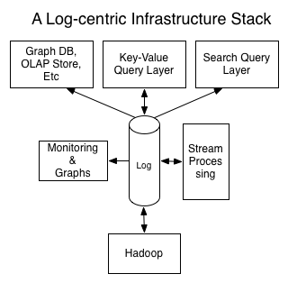

第四部分：系统建设
===============================

我们最后要讨论的是在线数据系统设计中日志的角色。

在分布式数据库数据流中日志的角色和在大型组织机构数据完整中日志的角色是相似的。在这两个应用场景中，日志是对于数据源是可靠的，一致的和可恢复的。组织如果不是一个复杂的分布式数据系统呢，它究竟是什么？

分类计价吗？
-----------------

如果换个角度，你可以看到把整个组织系统和数据流看做是单一的分布式数据系统。你可以把所有的子查询系统（诸如Redis, SOLR,Hive表等）看成是数据的特定索引。你可以把Storm或Samza一样的流处理系统看成是发展良好的触发器和视图具体化机制。我已经注意到，传统的数据库管理人员非常喜欢这样的视图，因为它最终解释了这些不同的数据系统到底是做什么用的 —— 它们只是不同的索引类型而已。

不可否认这类数据库系统现在大量的出现，但是事实上，这种复杂性一直都存在。即使是在关系数据库系统的鼎盛时期，组织中有大量的关系数据库系统。或许自大型机时代开始，所有的数据都存储在相同的位置，真正的集成是根本不存在的。存在多种外在需求，需要把数据分解成多个系统，这些外在需求包括：规模、地理因素、安全性，性能隔离是最常见的因素。这些需求都可以由一个优质的系统实现：例如，组织可以使用单一的Hadoop聚簇，它包括了全部的数据，可以服务于大型的和多样性的客户。

因此在向分布式系统变迁的过程中，已经存在一种处理数据的简便的方法：把大量的不同系统的小的实例聚合成为大的聚簇。许多的系统还不足以支持这一方法：因为它们不够安全，或者性能隔离性得不到保证，或者规模不符合要求。不过这些问题都是可以解决的。

依我之见，不同系统大量出现的原因是建设分布式数据库系统很困难。通过削减到单一的查询或者用例，每个系统都可以把规模控制到易于实现的程度。但是运行这些系统产生的复杂度依然很高。

未来这类问题可能的发展趋势有三种：

第一种可能是保持现状：孤立的系统还会或长或短的持续一段时间。这是因为建设分布式系统的困难很难克服，或者因为孤立系统的独特性和便捷性很难达到。基于这些原因，数据集成的核心问题仍然是如何恰当的使用数据。因此，集成数据的外部日志非常的重要。

第二种可能是重构：具备通用性的单一的系统逐步融合多个功能形成超极系统。这个超级系统表面看起来类似关系数据库系统，但是在组织中你使用时最大的不同是你只需要一个大的系统而不是无数个小系统。在这个世界里，除了在系统内已解决的这个问题不存在什么真正的数据集成问题。我想这是因为建设这样的系统的实际困难。

虽然另一种可能的结果对于工程师来说是很有吸引力的。新一代数据库系统的特征之一是它们是完全开源的。开源提供了一种可能性：数据基础架构不必打包成服务集或者面向应用的系统接口。在Java栈中，你可以看到在一定程度上，这种状况已经发生了。

- [Zookeeper](http://zookeeper.apache.org/)用于处理多个系统之间的协调，或许会从诸如[Helix](http://helix.incubator.apache.org/) 或者[Curator](http://curator.incubator.apache.org/)等高级别的抽象中得到一些帮助。
- [Mesos](http://mesos.apache.org/)和[YARN](http://hadoop.apache.org/docs/current/hadoop-yarn/hadoop-yarn-site/YARN.html)用于处理流程可视化和资源管理。
- [Lucene](http://lucene.apache.org/)和[LevelDB](https://code.google.com/p/leveldb)等嵌入式类库做为索引。
- [Netty](http://netty.io/),[Jetty](http://www.eclipse.org/jetty)和[Finagle](http://twitter.github.io/finagle),[rest.li](http://rest.li/)等封装成高级别的用于处理远程通信。
- [Avro](http://avro.apache.org/),[Protocol Buffers](https://code.google.com/p/protobuf),[Thrift](http://thrift.apache.org/)和[umpteen zillion](https://github.com/eishay/jvm-serializers/wiki)等其它类库用于处理序列化。
- [Kafka](http://kafka.apache.org/)和[Bookeeper](http://zookeeper.apache.org/bookkeeper)提供支持日志。

如果你把这些堆放在一起，换个角度看，它有点像是简化版的分布式数据库系统工程。你可以把这些拼装在一起，创建大量的可能的系统。显而易见，现在探讨的不是最终用户所关心的API或者如何实现，而是在不断多样化和模块化的过程中如何设计实现单一系统的途径。因为随着可靠的、灵活的模块的出现，实施分布式系统的时间周期由年缩减为周，聚合形成大型整体系统的压力逐步消失。

日志文件在系统结构中的地位
---------------------------------

那些提供外部日志的系统如今已允许个人电脑抛弃他们自身复杂的日志系统转而使用共享日志。在我看来，日志可以做到以下事情：

- 通过对节点的并发更新的排序处理数据的一致性（无论在及时还是最终情况下）
- 提供节点之间的数据复制
- 提供”commit“语法（只有当写入器确保数据不会丢失时才会写入）
- 位系统提供外部的数据订阅资源
- 提供存储失败的复制操作和引导新的复制操作的能力
- 处理节点间的数据平衡

这实际上是一个数据分发系统最重要的部分，剩下的大部分内容与终端调用的API和索引策略相关。这正是不同系统间的差异所在，例如：一个全文本查询语句需要查询所有的分区，而一个主键查询只需要查询负责键数据的单个节点就可以了。

下面我们来看下该系统是如何工作的。系统被分为两个逻辑区域：日志和服务层。日志按顺序捕获状态变化，服务节点存储索引提供查询服务需要的所有信息（键-值的存储可能以B-tree或SSTable的方式进行，而搜索系统可能存在与之相反的索引）。写入器可以直接访问日志，尽管需要通过服务层代理。在写入日志的时候会产生逻辑时间戳（即log中的索引），如果系统是分段式的，那么就会产生与段数目相同数量的日志文件和服务节点，这里的数量和机器数量可能会有较大差距。

服务节点订阅日志信息并将写入器按照日志存储的顺序尽快应用到它的本地索引上。

客户端只要在查询语句中提供对应的写入器的时间戳，它就可以从任何节点中获取”读写“语义。服务节点收到该查询语句后会将其中的时间戳与自身的索引比较，如果必要，服务节点会延迟请求直到对应时间的索引建立完毕，以免提供旧数据。

服务节点或许根本无需知道”控制“或”投标选择（leader election）“的概念，对很多简单的操作，服务节点可以爱完全脱离领导的情况下提供服务，日志即是信息的来源。

分发系统所需要做的其中一个比较复杂的工作，就是修复失败节点并移除几点之间的隔离。保留修复的数据并结合上各区域内的数据快照是一种较为典型的做法，它与保留完整的数据备份并从[垃圾箱内回收日志](https://cwiki.apache.org/confluence/display/KAFKA/Log+Compaction)的做法几乎等价。这就使得服务层简单了很多，日志系统也更有针对性。 

有了这个日志系统，你可以订阅到API，这个API提供了把ETL提供给其它系统的数据内容。事实上，许多系统都可以共享相同的日志同时提供不同的索引，如下所示：

这样一个以日志为中心的系统是如何做到既数据流的提供者又同时加载其它系统的数据的呢？因为流处理器既可以消费多个输入的数据流，随后又可以通过其它系统对数据做索引为它们提供服务。

这个系统的视图可以清晰的分解到日志和查询API,因为它允许你从系统的可用性和一致性角度分解查询的特征。这可以帮助我们对系统进行分解，并理解那些并没按这种方式设计实施的系统。

虽然Kafka和Bookeeper都是一致性日志，但这不是必须的，也没什么意义。你可以轻松的把[Dynamo](http://www.allthingsdistributed.com/2007/10/amazons_dynamo.html)之类的数据构分解为一致性的[AP](http://en.wikipedia.org/wiki/CAP_theorem)日志和键值对服务层。这样的日志使用起来灵活，因为它重传了旧消息，像Dynamo一样，这样的处理取决于消息的订阅者。

在很多人看来，在日志中另外保存一份数据的完整复本是一种浪费。事实上，虽然有很多因素使得这件事并不困难。首先，日志可以是一种有效的存储机制。我们在Kafka生产环境的服务器上存储了5 TB的数据。同时有许多的服务系统需要更多的内存来提供有效的数据服务，例如文本搜索，它通常是在内存中的。服务系统同样也需样硬盘的优化。例如，我们的实时数据系统或者在内存外提供服务或者使用固态硬盘。相反，日志系统只需要线性的读写，因此，它很乐于使用TB量级的硬盘。最终，如上图所示，由多个系统提供的数据，日志的成本分摊到多个索引上，这种聚合使得外部日志的成本降到了最低点。

LinkedIn就是使用了这种方式实现它的多个实时查询系统的。这些系统提供了一个数据库（使用数据总线做为日志摘要，或者从Kafka去掉专用的日志），这些系统在顶层数据流上还提供了特殊的分片、索引和查询功能。这也是我们实施搜索、社交网络和OLAP查询系统的方式。事实上这种方式是相当普遍的：为多个用于实时服务的服务系统提供单一的数据（这些来自Hadoop的数据或是实时的或是衍生的）。这种方式已被证实是相当简洁的。这些系统根本不需要外部可写入的API，Kafka和数据库被用做系统的记录和变更流，通过日志你可以查询系统。持有特定分片的结点在本地完成写操作。这些结点盲目的把日志提供的数据转录到它们自己的存储空间中。通过回放上行流日志可以恢复转录失败的结点。

这些系统的程度则取决于日志的多样性。一个完全可靠的系统可以用日志来对数据分片、存储结点、均衡负载，以及用于数据一致性和数据复制等多方面。在这一过程中，服务层实际上只不过是一种缓存机制，这种缓存机制允许直接写入日志的流处理。

-----------------

[« 第三部分：日志和实时流处理](part3.md)　　　　[结束语 »](the-end.md)
